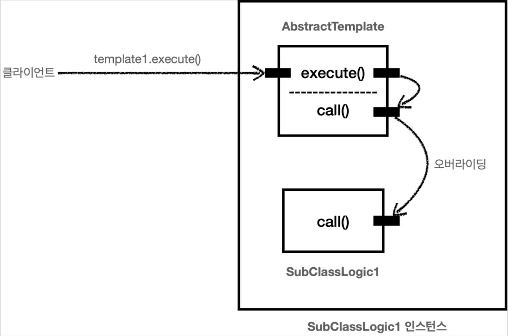
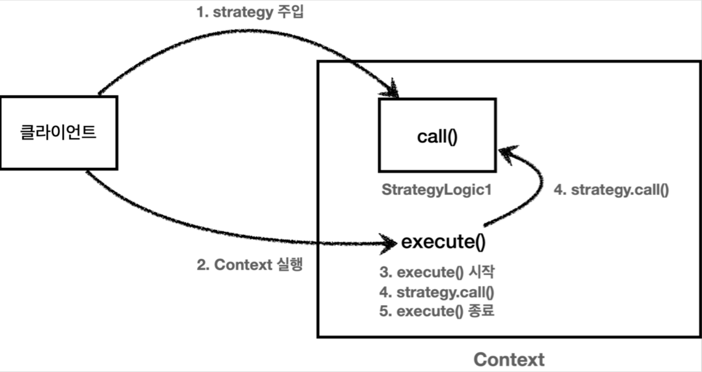
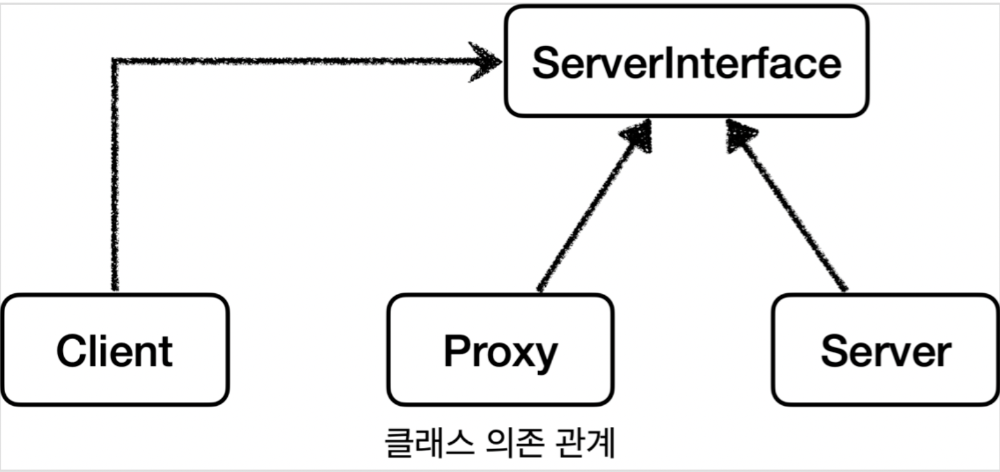
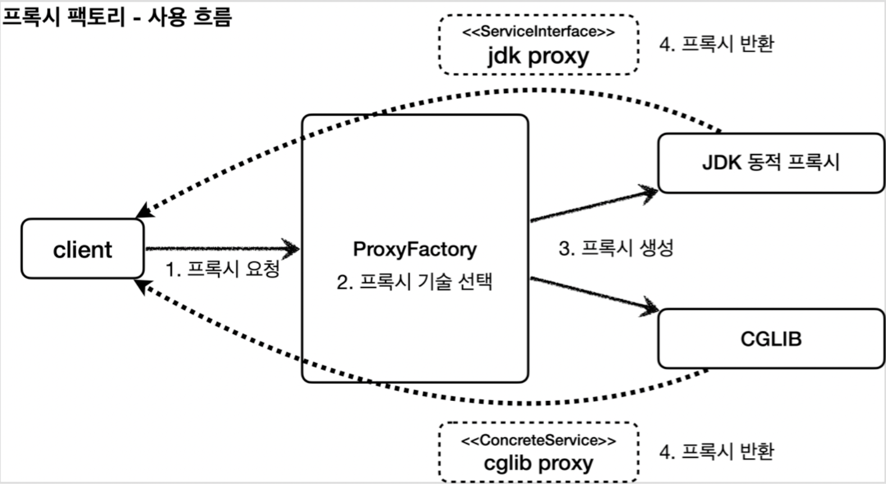
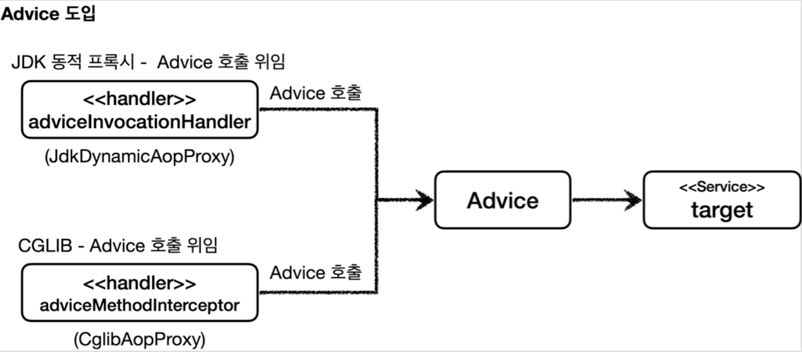
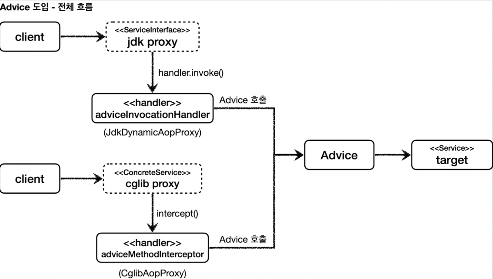
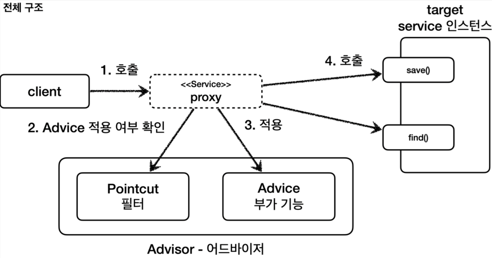

# 김영한님 스프링 핵심 원리 - 고급편 스터디

### 로그 추적기

**요구사항**

- 모든 PUBLIC 메서드의 호출과 응답 정보를 로그로 출력
- 애플리케이션의 흐름을 변경하면 안됨
    - 로그를 남긴다고 해서 비즈니스 로직의 동작에 영향을 주면 안됨
- 메서드 호출에 걸린 시간
- 정상 흐름과 예외 흐름 구분
    - 예외 발생시 예외 정보가 남아야 함
- 메서드 호출의 깊이 표현
- HTTP 요청을 구분
    - HTTP 요청 단위로 특정 ID를 남겨서 어떤 HTTP 요청에서 시작된 것인지 명확하게 구분이 가능해야 함
    - 트랜잭션 ID (DB 트랜잭션X), 여기서는 하나의 HTTP 요청이 시작해서 끝날 때 까지를 하나의 트랜잭션이라 함

**동시성 문제**

FieldLogTrace 는 싱글톤으로 등록된 스프링 빈이다. 이 객체의 인스턴스가 애플리케이션에 딱 1 존재한다는 뜻이다. 이렇게 하나만 있는 인스턴스의 FieldLogTrace.traceIdHolder 필드를 여러 쓰레드가 동시에 접근하기 때문에 문제가 발생한다.

여러 쓰레드가 동시에 같은 인스턴스의 필드 값을 변경하면서 발생하는 문제를 동시성 문제라 한다. 이런 동시성 문제는 여러 쓰레드가 같은 인스턴스의 필드에 접근해야 하기 때문에 트래픽이 적은 상황에서는 확률상 잘 나타나지 않고, 트래픽이 점점 많아질 수 록 자주 발생한다.
특히 스프링 빈 처럼 싱글톤 객체의 필드를 변경하며 사용할 때 이러한 동시성 문제를 조심해야 한다.

> **참고**
>
>
> 이런 동시성 문제는 지역 변수에서는 발생하지 않는다. 지역 변수는 쓰레드마다 각각 다른 메모리 영역이 할당된다.
> 동시성 문제가 발생하는 곳은 같은 인스턴스의 필드(주로 싱글톤에서 자주 발생), 또는 static 같은 공용 필드에 접근할 때 발생한다.
> 동시성 문제는 값을 읽기만 하면 발생하지 않는다. 어디선가 값을 변경하기 때문에 발생한다.
>

그렇다면 지금처럼 싱글톤 객체의 필드를 사용하면서 동시성 문제를 해결하려면 어떻게 해야할까? 다시
파라미터를 전달하는 방식으로 돌아가야 할까? 이럴 때 사용하는 것이 바로 쓰레드 로컬이다.

### **ThreadLocal**

쓰레드 로컬은 해당 쓰레드만 접근할 수 있는 특별한 저장소를 말한다.

- **일반적인 변수 필드**
  여러 쓰레드가 같은 인스턴스의 필드에 접근하면 처음 쓰레드가 보관한 데이터가 사라질 수 있다.
- **쓰레드 로컬**
  쓰레드 로컬을 사용하면 각 쓰레드마다 별도의 내부 저장소를 제공한다. 따라서 같은 인스턴스의 쓰레드 로컬 필드에 접근해도 문제 없다.

자바는 언어차원에서 쓰레드 로컬을 지원하기 위한 java.lang.ThreadLocal 클래스를 제공한다.

쓰레드 로컬 덕분에 쓰레드 마다 각각 별도의 데이터 저장소를 가지게 되었다. 결과적으로 동시성 문제도 해결되었다.

값을 저장할 때는 set(..) 을 사용하고, 값을 조회할 때는 get() 을 사용한다.

**ThreadLocal.remove()**

추가로 쓰레드 로컬을 모두 사용하고 나면 꼭 ThreadLocal.remove() 를 호출해서 쓰레드 로컬에 저장된 값을 제거해주어야 한다.

- **쓰레드 로컬 - 주의사항**
    - 쓰레드 로컬의 값을 사용 후 제거하지 않고 그냥 두면 WAS(톰캣)처럼 쓰레드 풀을 사용하는 경우에 심각한 문제가 발생할 수 있다.
    - WAS는 사용이 끝난 thread-A 를 쓰레드 풀에 반환한다. 쓰레드를 생성하는 비용은 비싸기 때문에
      쓰레드를 제거하지 않고, 보통 쓰레드 풀을 통해서 쓰레드를 재사용한다.
    - thread-A 는 쓰레드풀에 아직 살아있다. 따라서 쓰레드 로컬의 thread-A 전용 보관소에 사용자A 데이터도 함께 살아있게 된다.
    - 이런 문제를 예방하려면 사용자A의 요청이 끝날 때 쓰레드 로컬의 값을 ThreadLocal.remove() 를
      통해서 꼭 제거해야 한다.

### 템플릿 메서드 패턴

- **핵심 기능 vs 부가 기능**
    - **핵심 기능**은 해당 객체가 제공하는 고유의 기능이다. 예를 들어서 orderService 의 핵심 기능은 주문 로직이다. 메서드 단위로 보면 orderService.orderItem() 의 핵심 기능은 주문 데이터를 저장하기 위해 리포지토리를 호출하는 orderRepository.save(itemId) 코드가 핵심 기능이다.
    - **부가 기능**은 핵심 기능을 보조하기 위해 제공되는 기능이다. 예를 들어서 로그 추적 로직, 트랜잭션 기능이 있다. 이러한 부가 기능은 단독으로 사용되지는 않고, 핵심 기능과 함께 사용된다. 예를 들어서 로그 추적 기능은 어떤 핵심 기능이 호출되었는지 로그를 남기기 위해 사용한다. 그러니까 핵심 기능을 보조하기 위해 존재한다.
- **변하는 것과 변하지 않는 것을 분리**
    - 좋은 설계는 변하는 것과 변하지 않는 것을 분리하는 것이다.
    - 여기서 핵심 기능 부분은 변하고, 로그 추적기를 사용하는 부분은 변하지 않는 부분이다. 이 둘을 분리해서 모듈화해야 한다.
    - 템플릿 메서드 패턴(Template Method Pattern)은 이런 문제를 해결하는 디자인 패턴이다.
- 템플릿 메서드 패턴은 이름 그대로 템플릿을 사용하는 방식이다. 템플릿은 기준이 되는 거대한 틀이다. 템플릿이라는 틀에 변하지 않는 부분을 몰아둔다. 그리고 일부 변하는 부분을 별도로 호출해서 해결한다.
- 템플릿 메서드 패턴은 부모 클래스에 변하지 않는 템플릿 코드를 둔다. 그리고 변하는 부분은 자식 클래스에 두고 상속과 오버라이딩을 사용해서 처리한다.
- 템플릿 메서드 패턴은 이렇게 다형성을 사용해서 변하는 부분과 변하지 않는 부분을 분리하는 방법이다.

  

- **익명 내부 클래스 사용하기**
    - 템플릿 메서드 패턴은 SubClassLogic1 , SubClassLogic2 처럼 클래스를 계속 만들어야 하는 단점이
      있다. 익명 내부 클래스를 사용하면 이런 단점을 보완할 수 있다.
    - 익명 내부 클래스를 사용하면 객체 인스턴스를 생성하면서 동시에 생성할 클래스를 상속 받은 자식 클래스를 정의할 수 있다. 이 클래스는 SubClassLogic1 처럼 직접 지정하는 이름이 없고 클래스 내부에 선언되는 클래스여서 익명 내부 클래스라 한다.
- **좋은 설계란?**
  좋은 설계라는 것은 무엇일까? 수 많은 멋진 정의가 있겠지만, 진정한 좋은 설계는 바로 **변경**이 일어날 때
  자연스럽게 드러난다.
  지금까지 로그를 남기는 부분을 모아서 하나로 모듈화하고, 비즈니스 로직 부분을 분리했다. 여기서 만약
  로그를 남기는 로직을 변경해야 한다고 생각해보자. 그래서 AbstractTemplate 코드를 변경해야 한다
  가정해보자. 단순히 AbstractTemplate 코드만 변경하면 된다.
  템플릿이 없는 V3 상태에서 로그를 남기는 로직을 변경해야 한다고 생각해보자. 이 경우 모든 클래스를 다
  찾아서 고쳐야 한다. 클래스가 수백 개라면 생각만해도 끔찍하다.
- **단일 책임 원칙(SRP)**
  V4 는 단순히 템플릿 메서드 패턴을 적용해서 소스코드 몇줄을 줄인 것이 전부가 아니다.
  로그를 남기는 부분에 단일 책임 원칙(SRP)을 지킨 것이다. 변경 지점을 하나로 모아서 변경에 쉽게 대처할
  수 있는 구조를 만든 것이다.

### **템플릿 메서드 패턴 - 정의**

> 템플릿 메서드 디자인 패턴의 목적은 다음과 같습니다.
"작업에서 알고리즘의 골격을 정의하고 일부 단계를 하위 클래스로 연기합니다. 템플릿 메서드를 사용하면 하위 클래스가 알고리즘의 구조를 변경하지 않고도 알고리즘의 특정 단계를 재정의할 수 있습니다." [GOF]
>

부모 클래스에 알고리즘의 골격인 템플릿을 정의하고, 일부 변경되는 로직은 자식 클래스에 정의하는 것이다. 이렇게 하면 자식 클래스가 알고리즘의 전체 구조를 변경하지 않고, 특정 부분만 재정의할 수 있다. 결국 상속과 오버라이딩을 통한 다형성으로 문제를 해결하는 것이다.

**하지만**

템플릿 메서드 패턴은 상속을 사용한다. 따라서 상속에서 오는 단점들을 그대로 안고간다. 특히 자식 클래스가 부모 클래스와 컴파일 시점에 강하게 결합되는 문제가 있다. 이것은 의존관계에 대한 문제이다.
자식 클래스 입장에서는 부모 클래스의 기능을 전혀 사용하지 않는다.

상속을 받는 다는 것은 특정 부모 클래스를 의존하고 있다는 것이다. 자식 클래스의 extends 다음에 바로 부모 클래스가 코드상에 지정되어 있다. 따라서 부모 클래스의 기능을 사용하든 사용하지 않든 간에 부모 클래스를 강하게 의존하게 된다. 여기서 강하게 의존한다는 뜻은 자식 클래스의 코드에 부모 클래스의 코드가 명확하게 적혀 있다는 뜻이다. UML에서 상속을 받으면 삼각형 화살표가 자식 -> 부모 를 향하고 있는 것은 이런 의존관계를 반영하는 것이다.

자식 클래스 입장에서는 부모 클래스의 기능을 전혀 사용하지 않는데, 부모 클래스를 알아야한다. 이것은 좋은 설계가 아니다. 그리고 이런 잘못된 의존관계 때문에 부모 클래스를 수정하면, 자식 클래스에도 영향을 줄 수 있다.

추가로 템플릿 메서드 패턴은 상속 구조를 사용하기 때문에, 별도의 클래스나 익명 내부 클래스를 만들어야 하는 부분도 복잡하다.
지금까지 설명한 이런 부분들을 더 깔끔하게 개선하려면 어떻게 해야할까?

템플릿 메서드 패턴과 비슷한 역할을 하면서 상속의 단점을 제거할 수 있는 디자인 패턴이 바로 전략 패턴(Strategy Pattern)이다.

### 전략 패턴

전략 패턴은 변하지 않는 부분을 Context 라는 곳에 두고, 변하는 부분을 Strategy 라는 인터페이스를 만들고 해당 인터페이스를 구현하도록 해서 문제를 해결한다. 상속이 아니라 위임으로 문제를 해결하는 것이다.
전략 패턴에서 Context 는 변하지 않는 템플릿 역할을 하고, Strategy 는 변하는 알고리즘 역할을 한다.

> 알고리즘 제품군을 정의하고 각각을 캡슐화하여 상호 교환 가능하게 만들자. 전략을 사용하면 알고리즘을 사용하는 클라이언트와 독립적으로 알고리즘을 변경할 수 있다.
>

ContextV1 은 변하지 않는 로직을 가지고 있는 템플릿 역할을 하는 코드이다. 전략 패턴에서는 이것을 컨텍스트(문맥)이라 한다.
쉽게 이야기해서 컨텍스트(문맥)는 크게 변하지 않지만, 그 문맥 속에서 strategy 를 통해 일부 전략이 변경된다 생각하면 된다.

Context 는 내부에 Strategy strategy 필드를 가지고 있다. 이 필드에 변하는 부분인 Strategy 의 구현체를 주입하면 된다.
전략 패턴의 핵심은 Context 는 Strategy 인터페이스에만 의존한다는 점이다. 덕분에 Strategy 의 구현체를 변경하거나 새로 만들어도 Context 코드에는 영향을 주지 않는다.

어디서 많이 본 코드 같지 않은가? 그렇다. 바로 스프링에서 의존관계 주입에서 사용하는 방식이 바로 전략 패턴이다.



1. Context 에 원하는 Strategy 구현체를 주입한다.
2. 클라이언트는 context 를 실행한다.
3. context 는 context 로직을 시작한다.
4. context 로직 중간에 strategy.call() 을 호출해서 주입 받은 strategy 로직을 실행한다.
5. context 는 나머지 로직을 실행한다.

정리

- 지금까지 일반적으로 이야기하는 전략 패턴에 대해서 알아보았다. 변하지 않는 부분을 Context 에 두고 변하는 부분을 Strategy 를 구현해서 만든다. 그리고 Context 의 내부 필드에 Strategy 를 주입해서 사용했다.

**선 조립, 후 실행**
여기서 이야기하고 싶은 부분은 Context 의 내부 필드에 Strategy 를 두고 사용하는 부분이다.
이 방식은 Context 와 Strategy 를 실행 전에 원하는 모양으로 조립해두고, 그 다음에 Context 를 실행하는 선 조립, 후 실행 방식에서 매우 유용하다.
Context 와 Strategy 를 한번 조립하고 나면 이후로는 Context 를 실행하기만 하면 된다. 우리가 스프링으로 애플리케이션을 개발할 때 애플리케이션 로딩 시점에 의존관계 주입을 통해 필요한 의존관계를 모두 맺어두고 난 다음에 실제 요청을 처리하는 것 과 같은 원리이다.
이 방식의 단점은 Context 와 Strategy 를 조립한 이후에는 전략을 변경하기가 번거롭다는 점이다. 물론 Context 에 setter 를 제공해서 Strategy 를 넘겨 받아 변경하면 되지만, Context 를 싱글톤으로 사용할 때는 동시성 이슈 등 고려할 점이 많다. 그래서 전략을 실시간으로 변경해야 하면 차라리 이전에 개발한 테스트 코드 처럼 Context 를 하나더 생성하고 그곳에 다른 Strategy 를 주입하는 것이 더 나은 선택일 수 있다.

전략을 파라미터로 전달 받는 방식
Context 와 Strategy 를 '선 조립 후 실행'하는 방식이 아니라 Context 를 실행할 때 마다 전략을 인수로 전달한다.
클라이언트는 Context 를 실행하는 시점에 원하는 Strategy 를 전달할 수 있다. 따라서 이전 방식과 비교해서 원하는 전략을 더욱 유연하게 변경할 수 있다.
테스트 코드를 보면 하나의 Context 만 생성한다. 그리고 하나의 Context 에 실행 시점에 여러 전략을 인수로 전달해서 유연하게 실행하는 것을 확인할 수 있다.

1. 클라이언트는 Context 를 실행하면서 인수로 Strategy 를 전달한다.
2. Context 는 execute() 로직을 실행한다.
3. Context 는 파라미터로 넘어온 strategy.call() 로직을 실행한다.
4. Context 의 execute() 로직이 종료된다.

**정리**

- ContextV1 은 필드에 Strategy 를 저장하는 방식으로 전략 패턴을 구사했다.
    - 선 조립, 후 실행 방법에 적합하다.
    - Context 를 실행하는 시점에는 이미 조립이 끝났기 때문에 전략을 신경쓰지 않고 단순히 실행만 하면 된다.
- ContextV2 는 파라미터에 Strategy 를 전달받는 방식으로 전략 패턴을 구사했다.
    - 실행할 때 마다 전략을 유연하게 변경할 수 있다.
    - 단점 역시 실행할 때 마다 전략을 계속 지정해주어야 한다는 점이다.

**템플릿**

지금 우리가 해결하고 싶은 문제는 변하는 부분과 변하지 않는 부분을 분리하는 것이다.
변하지 않는 부분을 템플릿이라고 하고, 그 템플릿 안에서 변하는 부분에 약간 다른 코드 조각을 넘겨서 실행하는 것이 목적이다.
ContextV1 , ContextV2 두 가지 방식 다 문제를 해결할 수 있지만, 어떤 방식이 조금 더 나아 보이는가?
지금 우리가 원하는 것은 애플리케이션 의존 관계를 설정하는 것 처럼 선 조립, 후 실행이 아니다. 단순히 코드를 실행할 때 변하지 않는 템플릿이 있고, 그 템플릿 안에서 원하는 부분만 살짝 다른 코드를 실행하고 싶을 뿐이다.
따라서 우리가 고민하는 문제는 실행 시점에 유연하게 실행 코드 조각을 전달하는 ContextV2 가 더 적합하다.

### **템플릿 콜백 패턴**

ContextV2 는 변하지 않는 템플릿 역할을 한다. 그리고 변하는 부분은 파라미터로 넘어온 Strategy 의 코드를 실행해서 처리한다. 이렇게 다른 코드의 인수로서 넘겨주는 실행 가능한 코드를 콜백(callback)이라 한다.

> **콜백 정의**
프로그래밍에서 콜백(callback) 또는 콜애프터 함수(call-after function)는 다른 코드의 인수로서 넘겨주는 실행 가능한 코드를 말한다. 콜백을 넘겨받는 코드는 이 콜백을 필요에 따라 즉시 실행할 수도 있고, 아니면 나중에 실행할 수도 있다. (위키백과 참고)
>

쉽게 이야기해서 callback 은 코드가 호출( call )은 되는데 코드를 넘겨준 곳의 뒤( back )에서 실행된다는 뜻이다.

**자바 언어에서 콜백**

- 자바 언어에서 실행 가능한 코드를 인수로 넘기려면 객체가 필요하다. 자바8부터는 람다를 사용할 수 있다.
- 자바 8 이전에는 보통 하나의 메소드를 가진 인터페이스를 구현하고, 주로 익명 내부 클래스를 사용했다.
- 최근에는 주로 람다를 사용한다.

**템플릿 콜백 패턴**

- 스프링에서는 ContextV2 와 같은 방식의 전략 패턴을 템플릿 콜백 패턴이라 한다. 전략 패턴에서
  Context 가 템플릿 역할을 하고, Strategy 부분이 콜백으로 넘어온다 생각하면 된다.
- 참고로 템플릿 콜백 패턴은 GOF 패턴은 아니고, 스프링 내부에서 이런 방식을 자주 사용하기 때문에,
  스프링 안에서만 이렇게 부른다. 전략 패턴에서 템플릿과 콜백 부분이 강조된 패턴이라 생각하면 된다.
- 스프링에서는 JdbcTemplate , RestTemplate , TransactionTemplate , RedisTemplate 처럼 다양한
  템플릿 콜백 패턴이 사용된다. 스프링에서 이름에 XxxTemplate 가 있다면 템플릿 콜백 패턴으로 만들어져
  있다 생각하면 된다.

**정리**

지금까지 우리는 변하는 코드와 변하지 않는 코드를 분리하고, 더 적은 코드로 로그 추적기를 적용하기 위해 고군분투 했다.
템플릿 메서드 패턴, 전략 패턴, 그리고 템플릿 콜백 패턴까지 진행하면서 변하는 코드와 변하지 않는 코드를 분리했다. 그리고 최종적으로 템플릿 콜백 패턴을 적용하고 콜백으로 람다를 사용해서 코드 사용도 최소화 할 수 있었다.

**한계**

그런데 지금까지 설명한 방식의 한계는 아무리 최적화를 해도 결국 로그 추적기를 적용하기 위해서 원본 코드를 수정해야 한다는 점이다. 클래스가 수백개이면 수백개를 더 힘들게 수정하는가 조금 덜 힘들게 수정하는가의 차이가 있을 뿐, 본질적으로 코드를 다 수정해야 하는 것은 마찬가지이다.

개발자의 게으름에 대한 욕심은 끝이 없다. 수 많은 개발자가 이 문제에 대해서 집요하게 고민해왔고, 여러가지 방향으로 해결책을 만들어왔다. 지금부터 원본 코드를 손대지 않고 로그 추적기를 적용할 수 있는 방법을 알아보자. 그러기 위해서 프록시 개념을 먼저 이해해야 한다.

**참고**> 지금까지 설명한 방식은 실제 스프링 안에서 많이 사용되는 방식이다. XxxTemplate 를 만나면 이번에 학습한 내용을 떠올려보면 어떻게 돌아가는지 쉽게 이해할 수 있을 것이다.

### 프록시

- v1 - 인터페이스와 구현 클래스 - 스프링 빈으로 수동 등록
- v2 - 인터페이스 없는 구체 클래스 - 스프링 빈으로 수동 등록
- v3 - 컴포넌트 스캔으로 스프링 빈 자동 등록

실무에서는 스프링 빈으로 등록할 클래스는 인터페이스가 있는 경우도 있고 없는 경우도 있다. 그리고 스프링 빈을 수동으로 직접 등록하는 경우도 있고, 컴포넌트 스캔으로 자동으로 등록하는 경우도 있다.

**대리자를 영어로 프록시(Proxy)**

직접 호출과 다르게 간접 호출을 하면 대리자가 중간에서 여러가지 일을 할 수 있다.

- 접근제어, 캐싱
- 부가 기능 추가
- 프록시 체인

**대체 가능**

그런데 여기까지 듣고 보면 아무 객체나 프록시가 될 수 있는 것 같다.
객체에서 프록시가 되려면, 클라이언트는 서버에게 요청을 한 것인지, 프록시에게 요청을 한 것인지 조차 몰라야 한다.
쉽게 이야기해서 서버와 프록시는 같은 인터페이스를 사용해야 한다. 그리고 클라이언트가 사용하는 서버 객체를 프록시 객체로 변경해도 클라이언트 코드를 변경하지 않고 동작할 수 있어야 한다.



**서버와 프록시가 같은 인터페이스 사용**

클래스 의존관계를 보면 클라이언트는 서버 인터페이스( ServerInterface )에만 의존한다. 그리고 서버와 프록시가 같은 인터페이스를 사용한다. 따라서 DI를 사용해서 대체 가능하다.

DI를 사용하면 클라이언트 코드의 변경 없이 유연하게 프록시를 주입할 수 있다.

**프록시의 주요 기능**

프록시를 통해서 할 수 있는 일은 크게 2가지로 구분할 수 있다.

- 접근 제어
    - 권한에 따른 접근 차단
    - 캐싱
    - 지연 로딩
- 부가 기능 추가
    - 원래 서버가 제공하는 기능에 더해서 부가 기능을 수행한다.
    - 예) 요청 값이나, 응답 값을 중간에 변형한다.
    - 예) 실행 시간을 측정해서 추가 로그를 남긴다.

프록시 객체가 중간에 있으면 크게 **접근 제어**와 **부가 기능 추가**를 수행할 수 있다.

**GOF 디자인 패턴**
둘다 프록시를 사용하는 방법이지만 GOF 디자인 패턴에서는 이 둘을 의도(intent)에 따라서 프록시 패턴과 데코레이터 패턴으로 구분한다.
프록시 패턴: 접근 제어가 목적
데코레이터 패턴: 새로운 기능 추가가 목적

둘다 프록시를 사용하지만, 의도가 다르다는 점이 핵심이다. 용어가 프록시 패턴이라고 해서 이 패턴만 프록시를 사용하는 것은 아니다. 데코레이터 패턴도 프록시를 사용한다.

> **참고**: 프록시라는 개념은 클라이언트 서버라는 큰 개념안에서 자연스럽게 발생할 수 있다. 프록시는
객체안에서의 개념도 있고, 웹 서버에서의 프록시도 있다. 객체안에서 객체로 구현되어있는가, 웹 서버로
구현되어 있는가 처럼 규모의 차이가 있을 뿐 근본적인 역할은 같다.
>

### **프록시 패턴**

프록시도 실제 객체와 그 모양이 같아야 하기 때문에 Subject 인터페이스를 구현해야 한다.

private Subject target : 클라이언트가 프록시를 호출하면 프록시가 최종적으로 실제 객체를 호출해야 한다. 따라서 내부에 실제 객체의 참조를 가지고 있어야 한다. 이렇게 프록시가 호출하는 대상을 target 이라 한다.

operation() : 구현한 코드를 보면 cacheValue 에 값이 없으면 실제 객체( target )를 호출해서 값을 구한다. 그리고 구한 값을 cacheValue 에 저장하고 반환한다. 만약 cacheValue 에 값이 있으면 실제 객체를 전혀 호출하지 않고, 캐시 값을 그대로 반환한다. 따라서 처음 조회 이후에는 캐시( cacheValue ) 에서 매우 빠르게 데이터를 조회할 수 있다.

realSubject 와 cacheProxy 를 생성하고 둘을 연결한다. 결과적으로 cacheProxy 가 realSubject 를 참조하는 런타임 객체 의존관계가 완성된다. 그리고 마지막으로 client 에 realSubject 가 아닌 cacheProxy 를 주입한다. 이 과정을 통해서 client -> cacheProxy -> realSubject 런타임 객체 의존 관계가 완성된다.

**정리**

프록시 패턴의 핵심은 RealSubject 코드와 클라이언트 코드를 전혀 변경하지 않고, 프록시를 도입해서 접근 제어를 했다는 점이다.
그리고 클라이언트 코드의 변경 없이 자유롭게 프록시를 넣고 뺄 수 있다. 실제 클라이언트 입장에서는 프록시 객체가 주입되었는지, 실제 객체가 주입되었는지 알지 못한다.

### **데코레이터 패턴**

**부가 기능 추가**

앞서 설명한 것 처럼 프록시를 통해서 할 수 있는 기능은 크게 접근 제어와 부가 기능 추가라는 2가지로 구분한다. 앞서 프록시 패턴에서 캐시를 통한 접근 제어를 알아보았다. 이번에는 프록시를 활용해서 부가 기능을 추가해보자. 이렇게 프록시로 부가 기능을 추가하는 것을 데코레이터 패턴이라 한다.

데코레이터 패턴: 원래 서버가 제공하는 기능에 더해서 부가 기능을 수행한다.
예) 요청 값이나, 응답 값을 중간에 변형한다.
예) 실행 시간을 측정해서 추가 로그를 남긴다.

**프록시 패턴 vs 데코레이터 패턴**
여기까지 진행하면 몇가지 의문이 들 것이다.
Decorator 라는 추상 클래스를 만들어야 데코레이터 패턴일까?
프록시 패턴과 데코레이터 패턴은 그 모양이 거의 비슷한 것 같은데?

**의도(intent)**
사실 프록시 패턴과 데코레이터 패턴은 그 모양이 거의 같고, 상황에 따라 정말 똑같을 때도 있다. 그러면 둘을 어떻게 구분하는 것일까?
디자인 패턴에서 중요한 것은 해당 패턴의 겉모양이 아니라 그 패턴을 만든 의도가 더 중요하다. 따라서 의도에 따라 패턴을 구분한다.

- 프록시 패턴의 의도: 다른 개체에 대한 **접근을 제어**하기 위해 대리자를 제공
- 데코레이터 패턴의 의도: **객체에 추가 책임(기능)을 동적으로 추가**하고, 기능 확장을 위한 유연한 대안 제공

### **인터페이스 기반 프록시**

**프록시를 사용하면 기존 코드를 전혀 수정하지 않고 로그 추적 기능을 도입할 수 있다.**

**프록시를 실제 스프링 빈 대신 등록한다. 실제 객체는 스프링 빈으로 등록하지 않는다.**

스프링 빈으로 실제 객체 대신에 프록시 객체를 등록했기 때문에 앞으로 스프링 빈을 주입 받으면 **실제 객체 대신에 프록시 객체가 주입**된다.
프록시와 DI 덕분에 원본 코드를 전혀 수정하지 않고, 로그 추적기를 도입할 수 있었다. 물론 너무 많은 프록시 클래스를 만들어야 하는 단점이 있기는 하다.

### **구체 클래스 기반 프록시**

지금까지 인터페이스를 기반으로 프록시를 도입했다. 그런데 자바의 다형성은 인터페이스를 구현하든, 아니면 클래스를 상속하든 상위 타입만 맞으면 다형성이 적용된다. 쉽게 이야기해서 인터페이스가 없어도 프록시를 만들수 있다는 뜻이다. 그래서 이번에는 인터페이스가 아니라 클래스를 기반으로 상속을 받아서 프록시를 만들어보겠다.

> **참고**: 자바 언어에서 다형성은 인터페이스나 클래스를 구분하지 않고 모두 적용된다. 해당 타입과 그 타입의 하위 타입은 모두 다형성의 대상이 된다. 자바 언어의 너무 기본적인 내용을 이야기했지만, 인터페이스가 없어도 프록시가 가능하다는 것을 확실하게 집고 넘어갈 필요가 있어서 자세히 설명했다.
>

**클래스 기반 프록시의 단점**

- super(null) : OrderServiceV2 : 자바 기본 문법에 의해 자식 클래스를 생성할 때는 항상 super() 로 부모 클래스의 생성자를 호출해야 한다. 이 부분을 생략하면 기본 생성자가 호출된다. 그런데 부모 클래스인 OrderServiceV2 는 기본 생성자가 없고, 생성자에서 파라미터 1개를 필수로 받는다. 따라서 파라미터를 넣어서 super(..) 를 호출해야 한다.
- 프록시는 부모 객체의 기능을 사용하지 않기 때문에 super(null) 을 입력해도 된다.
- 인터페이스 기반 프록시는 이런 고민을 하지 않아도 된다.

### **인터페이스 기반 프록시와 클래스 기반 프록시**

**프록시**

프록시를 사용한 덕분에 원본 코드를 전혀 변경하지 않고, V1, V2 애플리케이션에 LogTrace 기능을 적용할 수 있었다.

**인터페이스 기반 프록시 vs 클래스 기반 프록시**

- 인터페이스가 없어도 클래스 기반으로 프록시를 생성할 수 있다.
- 클래스 기반 프록시는 해당 클래스에만 적용할 수 있다. 인터페이스 기반 프록시는 인터페이스만 같으면 모든 곳에 적용할 수 있다.
- 클래스 기반 프록시는 상속을 사용하기 때문에 몇가지 제약이 있다.
    - 부모 클래스의 생성자를 호출해야 한다.(앞서 본 예제)
    - 클래스에 final 키워드가 붙으면 상속이 불가능하다.
    - 메서드에 final 키워드가 붙으면 해당 메서드를 오버라이딩 할 수 없다.

이렇게 보면 인터페이스 기반의 프록시가 더 좋아보인다. 맞다. 인터페이스 기반의 프록시는 상속이라는 제약에서 자유롭다. 프로그래밍 관점에서도 인터페이스를 사용하는 것이 역할과 구현을 명확하게 나누기 때문에 더 좋다.
인터페이스 기반 프록시의 단점은 인터페이스가 필요하다는 그 자체이다. 인터페이스가 없으면 인터페이스 기반 프록시를 만들 수 없다.

이론적으로는 모든 객체에 인터페이스를 도입해서 역할과 구현을 나누는 것이 좋다. 이렇게 하면 역할과 구현을 나누어서 구현체를 매우 편리하게 변경할 수 있다. 하지만 실제로는 구현을 거의 변경할 일이 없는 클래스도 많다.
인터페이스를 도입하는 것은 구현을 변경할 가능성이 있을 때 효과적인데, 구현을 변경할 가능성이 거의 없는 코드에 무작정 인터페이스를 사용하는 것은 번거롭고 그렇게 실용적이지 않다. 이런곳에는 실용적인 관점에서 인터페이스를 사용하지 않고 구체 클래스를 바로 사용하는 것이 좋다 생각한다. (물론 인터페이스를 도입하는 다양한 이유가 있다. 여기서 핵심은 인터페이스가 항상 필요하지는 않다는 것이다.)

**너무 많은 프록시 클래스**

지금까지 프록시를 사용해서 기존 코드를 변경하지 않고, 로그 추적기라는 부가 기능을 적용할 수 있었다.
그런데 문제는 프록시 클래스를 너무 많이 만들어야 한다는 점이다. 잘 보면 프록시 클래스가 하는 일은 LogTrace 를 사용하는 것인데, 그 로직이 모두 똑같다. 대상 클래스만 다를 뿐이다. 만약 적용해야 하는 대상 클래스가 100개라면 프록시 클래스도 100개를 만들어야한다.

프록시 클래스를 하나만 만들어서 모든 곳에 적용하는 방법은 없을까?
바로 다음에 설명할 동적 프록시 기술이 이 문제를 해결해준다.

### 동적 프록시

자바가 기본으로 제공하는 JDK 동적 프록시 기술이나 CGLIB 같은 프록시 생성 오픈소스 기술을 활용하면 프록시 객체를 동적으로 만들어낼 수 있다. 쉽게 이야기해서 프록시 클래스를 지금처럼 계속 만들지 않아도 된다는 것이다. 프록시를 적용할 코드를 하나만 만들어두고 동적 프록시 기술을 사용해서 프록시 객체를 찍어내면 된다.

JDK 동적 프록시를 이해하기 위해서는 먼저 자바의 리플렉션 기술을 이해해야 한다.
리플렉션 기술을 사용하면 클래스나 메서드의 메타정보를 동적으로 획득하고, 코드도 동적으로 호출할 수 있다.

### 리플렉션

리플렉션은 클래스나 메서드의 메타정보를 사용해서 동적으로 호출하는 메서드를 변경할 수 있다.

**참고**: 람다를 사용해서 공통화 하는 것도 가능하다.

**주의**

리플렉션을 사용하면 클래스와 메서드의 메타정보를 사용해서 애플리케이션을 동적으로 유연하게 만들 수 있다. 하지만 리플렉션 기술은 런타임에 동작하기 때문에, 컴파일 시점에 오류를 잡을 수 없다.
가장 좋은 오류는 개발자가 즉시 확인할 수 있는 컴파일 오류이고, 가장 무서운 오류는 사용자가 직접 실행할 때 발생하는 런타임 오류다.
따라서 리플렉션은 일반적으로 사용하면 안된다. 지금까지 프로그래밍 언어가 발달하면서 타입 정보를 기반으로 컴파일 시점에 오류를 잡아준 덕분에 개발자가 편하게 살았는데, 리플렉션은 그것에 역행하는 방식이다.
리플렉션은 프레임워크 개발이나 또는 매우 일반적인 공통 처리가 필요할 때 부분적으로 주의해서 사용해야 한다.

### **JDK 동적 프록시**

동적 프록시 기술을 사용하면 개발자가 직접 프록시 클래스를 만들지 않아도 된다. 이름 그대로 프록시 객체를 동적으로 런타임에 개발자 대신 만들어준다. 그리고 동적 프록시에 원하는 실행 로직을 지정할 수 있다.

**주의**> JDK 동적 프록시는 인터페이스를 기반으로 프록시를 동적으로 만들어준다. 따라서 인터페이스가 필수이다.

**JDK 동적 프록시가 제공하는 InvocationHandler
JDK 동적 프록시에 적용할 로직은 InvocationHandler 인터페이스를 구현해서 작성하면 된다.**

```java
AInterface target = new AImpl();
TimeInvocationHandler handler = new TimeInvocationHandler(target);
Proxy.newProxyInstance(AInterface.class.getClassLoader(), new Class[] {AInterface.class}, handler);
proxy.call();
```

동적 프록시는 java.lang.reflect.Proxy 를 통해서 생성할 수 있다.
클래스 로더 정보, 인터페이스, 그리고 핸들러 로직을 넣어주면 된다. 그러면 해당 인터페이스를 기반으로 동적 프록시를 생성하고 그 결과를 반환한다.

**생성된 JDK 동적 프록시**
proxyClass=class com.sun.proxy.$Proxy1 이 부분이 동적으로 생성된 프록시 클래스 정보이다.
이것은 우리가 만든 클래스가 아니라 JDK 동적 프록시가 이름 그대로 동적으로 만들어준 프록시이다. 이
프록시는 TimeInvocationHandler 로직을 실행한다.

**실행 순서**

1. 클라이언트는 JDK 동적 프록시의 call() 을 실행한다.
2. JDK 동적 프록시는 InvocationHandler.invoke() 를 호출한다. TimeInvocationHandler 가 구현체로 있으로 TimeInvocationHandler.invoke() 가 호출된다.
3. TimeInvocationHandler 가 내부 로직을 수행하고, method.invoke(target, args) 를 호출해서 target 인 실제 객체( AImpl )를 호출한다.
4. AImpl 인스턴스의 call() 이 실행된다.
5. AImpl 인스턴스의 call() 의 실행이 끝나면 TimeInvocationHandler 로 응답이 돌아온다. 시간 로그를 출력하고 결과를 반환한다.

**정리**

JDK 동적 프록시 기술 덕분에 적용 대상 만큼 프록시 객체를 만들지 않아도 된다. 그리고 같은 부가 기능 로직을 한번만 개발해서 공통으로 적용할 수 있다. 만약 적용 대상이 100개여도 동적 프록시를 통해서 생성하고, 각각 필요한 InvocationHandler 만 만들어서 넣어주면 된다.
결과적으로 프록시 클래스를 수 없이 만들어야 하는 문제도 해결하고, 부가 기능 로직도 하나의 클래스에 모아서 단일 책임 원칙(SRP)도 지킬 수 있게 되었다.

- JDK 동적 프록시는 인터페이스가 필수

**JDK 동적 프록시 - 한계**
JDK 동적 프록시는 인터페이스가 필수이다.
그렇다면 V2 애플리케이션 처럼 인터페이스 없이 클래스만 있는 경우에는 어떻게 동적 프록시를 적용할 수 있을까?
이것은 일반적인 방법으로는 어렵고 CGLIB 라는 바이트코드를 조작하는 특별한 라이브러리를 사용해야 한다.

스프링이 제공하는 PatternMatchUtils.simpleMatch(..) 를 사용하면 단순한 매칭 로직을 쉽게 적용할 수 있다.

- xxx : xxx가 정확히 매칭되면 참
- xxx* : xxx로 시작하면 참
- *xxx : xxx로 끝나면 참
- *xxx* : xxx가 있으면 참

### **CGLIB(Code Generator Library)**

소개

- CGLIB는 바이트코드를 조작해서 동적으로 클래스를 생성하는 기술을 제공하는 라이브러리이다.
- CGLIB를 사용하면 인터페이스가 없어도 구체 클래스만 가지고 동적 프록시를 만들어낼 수 있다.
- CGLIB는 원래는 외부 라이브러리인데, 스프링 프레임워크가 스프링 내부 소스 코드에 포함했다. 따라서 스프링을 사용한다면 별도의 외부 라이브러리를 추가하지 않아도 사용할 수 있다.

JDK 동적 프록시에서 실행 로직을 위해 InvocationHandler 를 제공했듯이, CGLIB는 MethodInterceptor 를 제공한다.

```java
public Object intercept(Object o, Method method, Object[] args, MethodProxy methodProxy) throws Throwable
```

o : CGLIB가 적용된 객체
method : 호출된 메서드
args : 메서드를 호출하면서 전달된 인수
methodProxy : 메서드 호출에 사용

JDK 동적 프록시는 인터페이스를 구현(implement)해서 프록시를 만든다. CGLIB는 구체 클래스를 상속 (extends)해서 프록시를 만든다.

**CGLIB 제약**

- 클래스 기반 프록시는 상속을 사용하기 때문에 몇가지 제약이 있다.
    - 부모 클래스의 생성자를 체크해야 한다. CGLIB는 자식 클래스를 동적으로 생성하기 때문에 기본 생성자가 필요하다.
    - 클래스에 final 키워드가 붙으면 상속이 불가능하다. CGLIB에서는 예외가 발생한다.
    - 메서드에 final 키워드가 붙으면 해당 메서드를 오버라이딩 할 수 없다. CGLIB에서는 프록시 로직이 동작하지 않는다.

**참고**
CGLIB를 사용하면 인터페이스가 없는 V2 애플리케이션에 동적 프록시를 적용할 수 있다. 그런데 지금 당장 적용하기에는 몇가지 제약이 있다. V2 애플리케이션에 기본 생성자를 추가하고, 의존관계를 setter 를 사용해서 주입하면 CGLIB를 적용할 수 있다. 하지만 다음에 학습하는 ProxyFactory 를 통해서 CGLIB를 적용하면 이런 단점을 해결하고 또 더 편리하기 때문에, 애플리케이션에 CGLIB로 프록시를 적용하는 것은 조금 뒤에 알아보겠다.

## **스프링이 지원하는 프록시**

### **프록시 팩토리**

스프링은 유사한 구체적인 기술들이 있을 때, 그것들을 통합해서 일관성 있게 접근할 수 있고, 더욱 편리하게 사용할 수 있는 추상화된 기술을 제공한다.
스프링은 동적 프록시를 통합해서 편리하게 만들어주는 프록시 팩토리( ProxyFactory )라는 기능을 제공한다.
이전에는 상황에 따라서 JDK 동적 프록시를 사용하거나 CGLIB를 사용해야 했다면, 이제는 이 프록시 팩토리 하나로 편리하게 동적 프록시를 생성할 수 있다.
프록시 팩토리는 인터페이스가 있으면 JDK 동적 프록시를 사용하고, 구체 클래스만 있다면 CGLIB를 사용한다. 그리고 이 설정을 변경할 수도 있다.



스프링은 이 문제를 해결하기 위해 부가 기능을 적용할 때 Advice 라는 새로운 개념을 도입했다. 개발자는 InvocationHandler 나 MethodInterceptor 를 신경쓰지 않고, Advice 만 만들면 된다.
결과적으로 InvocationHandler 나 MethodInterceptor 는 Advice 를 호출하게 된다.
프록시 팩토리를 사용하면 Advice 를 호출하는 전용 InvocationHandler , MethodInterceptor 를 내부에서 사용한다.





앞서 특정 메서드 이름의 조건에 맞을 때만 프록시 부가 기능이 적용되는 코드를 직접 만들었다. 스프링은 Pointcut 이라는 개념을 도입해서 이 문제를 일관성 있게 해결한다.

**Advice 만들기**
Advice 는 프록시에 적용하는 부가 기능 로직이다. 이것은 JDK 동적 프록시가 제공하는 InvocationHandler 와 CGLIB가 제공하는 MethodInterceptor 의 개념과 유사한다. 둘을 개념적으로 추상화 한 것이다. 프록시 팩토리를 사용하면 둘 대신에 Advice 를 사용하면 된다.

Advice 를 만드는 방법은 여러가지가 있지만, 기본적인 방법은 org.aopalliance.intercept.**MethodInterceptor** 인터페이스를 구현하면 된다.

```java
XXXService target = new XXXService();
ProxyFactory proxyFactory = new ProxyFactory(target);
Advice advice = new XXXAdvice();
proxyFactory.addAdvice(advice);
XXXService proxy = (XXXService) proxyFactory.getProxy();
```

### **포인트컷, 어드바이스, 어드바이저**

- **포인트컷**( Pointcut ): 어디에 부가 기능을 적용할지, 어디에 부가 기능을 적용하지 않을지 판단하는 필터링 로직이다. 주로 클래스와 메서드 이름으로 필터링 한다. 이름 그대로 어떤 포인트(Point)에 기능을 적용할지 하지 않을지 잘라서(cut) 구분하는 것이다.
- **어드바이스**( Advice ): 이전에 본 것 처럼 프록시가 호출하는 부가 기능이다. 단순하게 프록시 로직이라 생각하면 된다.
- **어드바이저**( Advisor ): 단순하게 하나의 포인트컷과 하나의 어드바이스를 가지고 있는 것이다. 쉽게 이야기해서 **포인트컷1 + 어드바이스1**이다.

정리하면 부가 기능 로직을 적용해야 하는데, 포인트컷으로 어디에? 적용할지 선택하고, 어드바이스로 어떤 로직을 적용할지 선택하는 것이다. 그리고 어디에? 어떤 로직?을 모두 알고 있는 것이 **어드바이저**이다.

**역할과 책임**

이렇게 구분한 것은 역할과 책임을 명확하게 분리한 것이다.
포인트컷은 대상 여부를 확인하는 필터 역할만 담당한다.
어드바이스는 깔끔하게 부가 기능 로직만 담당한다.
둘을 합치면 어드바이저가 된다. 스프링의 어드바이저는 하나의 포인트컷 + 하나의 어드바이스로 구성된다.

해당 단어들에 대한 정의는 지금은 문맥상 이해를 돕기 위해 프록시에 맞추어서 설명하지만, 이후에 AOP
부분에서 다시 한번 AOP에 맞추어 정리하겠다.



**스프링이 제공하는 포인트컷**

스프링은 무수히 많은 포인트컷을 제공한다.
대표적인 몇가지만 알아보자.

- NameMatchMethodPointcut : 메서드 이름을 기반으로 매칭한다. 내부에서는 PatternMatchUtils 를
  사용한다. 예) *xxx* 허용
- JdkRegexpMethodPointcut : JDK 정규 표현식을 기반으로 포인트컷을 매칭한다.
- TruePointcut : 항상 참을 반환한다.
- AnnotationMatchingPointcut : 애노테이션으로 매칭한다.
- AspectJExpressionPointcut : aspectJ 표현식으로 매칭한다.

**가장 중요한 것은 aspectJ 표현식**

여기에서 사실 다른 것은 중요하지 않다. 실무에서는 사용하기도 편리하고 기능도 가장 많은 aspectJ 표현식을 기반으로 사용하는 AspectJExpressionPointcut 을 사용하게 된다.

스프링은 AOP를 적용할 때, 최적화를 진행해서 지금처럼 프록시는 하나만 만들고, 하나의 프록시에 여러 어드바이저를 적용한다.
정리하면 하나의 target 에 여러 AOP가 동시에 적용되어도, 스프링의 AOP는 target 마다 하나의 프록시만 생성한다. 이부분을 꼭 기억해두자.

**정리**

프록시 팩토리 덕분에 개발자는 매우 편리하게 프록시를 생성할 수 있게 되었다.
추가로 어드바이저, 어드바이스, 포인트컷 이라는 개념 덕분에 **어떤 부가 기능**을 **어디에 적용**할 지 명확하게 이해할 수 있었다.

**남은 문제**

프록시 팩토리와 어드바이저 같은 개념 덕분에 지금까지 고민했던 문제들은 해결되었다. 프록시도 깔끔하게 적용하고 포인트컷으로 어디에 부가 기능을 적용할지도 명확하게 정의할 수 있다. 원본 코드를 전혀 손대지 않고 프록시를 통해 부가 기능도 적용할 수 있었다.
그런데 아직 해결되지 않는 문제가 있다.

**문제1 - 너무 많은 설정**
바로 ProxyFactoryConfigV1 , ProxyFactoryConfigV2 와 같은 설정 파일이 지나치게 많다는 점이다.
예를 들어서 애플리케이션에 스프링 빈이 100개가 있다면 여기에 프록시를 통해 부가 기능을 적용하려면 100개의 동적 프록시 생성 코드를 만들어야 한다! 무수히 많은 설정 파일 때문에 설정 지옥을 경험하게 될 것이다.
최근에는 스프링 빈을 등록하기 귀찮아서 컴포넌트 스캔까지 사용하는데, 이렇게 직접 등록하는 것도 모자라서, 프록시를 적용하는 코드까지 빈 생성 코드에 넣어야 한다.

**문제2 - 컴포넌트 스캔**
애플리케이션 V3처럼 컴포넌트 스캔을 사용하는 경우 지금까지 학습한 방법으로는 프록시 적용이 불가능하다.
왜냐하면 실제 객체를 컴포넌트 스캔으로 스프링 컨테이너에 스프링 빈으로 등록을 다 해버린 상태이기 때문이다.
지금까지 학습한 프록시를 적용하려면, 실제 객체를 스프링 컨테이너에 빈으로 등록하는 것이 아니라ProxyFactoryConfigV1 에서 한 것 처럼, 부가 기능이 있는 프록시를 실제 객체 대신 스프링 컨테이너에 빈으로 등록해야 한다.

**두 가지 문제를 한번에 해결하는 방법이 바로 다음에 설명할 빈 후처리기이다.**

### **빈 후처리기**

@Bean 이나 컴포넌트 스캔으로 스프링 빈을 등록하면, 스프링은 대상 객체를 생성하고 스프링 컨테이너 내부의 빈 저장소에 등록한다. 그리고 이후에는 스프링 컨테이너를 통해 등록한 스프링 빈을 조회해서 사용하면 된다.

**빈 후처리기 - BeanPostProcessor**

스프링이 빈 저장소에 등록할 목적으로 생성한 객체를 빈 저장소에 등록하기 직전에 조작하고 싶다면 빈 후처리기를 사용하면 된다.
빈 포스트 프로세서( BeanPostProcessor )는 번역하면 빈 후처리기인데, 이름 그대로 빈을 생성한 후에 무언가를 처리하는 용도로 사용한다.

**빈 후처리기 기능**

빈 후처리기의 기능은 막강하다.
객체를 조작할 수도 있고, 완전히 다른 객체로 바꿔치기 하는 것도 가능하다.

**정리**

빈 후처리기는 빈을 조작하고 변경할 수 있는 후킹 포인트이다.
이것은 빈 객체를 조작하거나 심지어 다른 객체로 바꾸어 버릴 수 있을 정도로 막강하다.
여기서 조작이라는 것은 해당 객체의 특정 메서드를 호출하는 것을 뜻한다.
일반적으로 스프링 컨테이너가 등록하는, 특히 컴포넌트 스캔의 대상이 되는 빈들은 중간에 조작할 방법이
없는데, 빈 후처리기를 사용하면 개발자가 등록하는 모든 빈을 중간에 조작할 수 있다. 이 말은 **빈 객체를
프록시로 교체**하는 것도 가능하다는 뜻이다.

> **참고 - @PostConstruct의 비밀**> @PostConstruct 는 스프링 빈 생성 이후에 빈을 초기화 하는 역할을 한다. 그런데 생각해보면 빈의 초기화 라는 것이 단순히 @PostConstruct 애노테이션이 붙은 초기화 메서드를 한번 호출만 하면 된다. 쉽게 이야기해서 생성된 빈을 한번 조작하는 것이다.
따라서 빈을 조작하는 행위를 하는 적절한 빈 후처리기가 있으면 될 것 같다.
스프링은 CommonAnnotationBeanPostProcessor 라는 빈 후처리기를 자동으로 등록하는데, 여기에서 @PostConstruct 애노테이션이 붙은 메서드를 호출한다. 따라서 스프링 스스로도 스프링 내부의 기능을
확장하기 위해 빈 후처리기를 사용한다.
>

빈 후처리기를 사용해서 실제 객체 대신 프록시를 스프링 빈으로 등록해보자.
이렇게 하면 수동으로 등록하는 빈은 물론이고, 컴포넌트 스캔을 사용하는 빈까지 모두 프록시를 적용할 수 있다.
더 나아가서 설정 파일에 있는 수 많은 프록시 생성 코드도 한번에 제거할 수 있다.

**중요**

프록시의 적용 대상 여부를 여기서는 간단히 패키지를 기준으로 설정했다. 그런데 잘 생각해보면 포인트컷을 사용하면 더 깔끔할 것 같다.

포인트컷은 이미 클래스, 메서드 단위의 필터 기능을 가지고 있기 때문에, 프록시 적용 대상 여부를 정밀하게 설정할 수 있다.

참고로 어드바이저는 포인트컷을 가지고 있다. 따라서 어드바이저를 통해 포인트컷을 확인할 수 있다.

뒤에서 학습하겠지만 스프링 AOP는 포인트컷을 사용해서 프록시 적용 대상 여부를 체크한다.

결과적으로 포인트컷은 다음 두 곳에 사용된다.

1. 프록시 적용 대상 여부를 체크해서 꼭 필요한 곳에만 프록시를 적용한다. (빈 후처리기 - 자동 프록시 생성)

2. 프록시의 어떤 메서드가 호출 되었을 때 어드바이스를 적용할 지 판단한다. (프록시 내부)

### **스프링이 제공하는 빈 후처리기**

`implementation 'org.springframework.boot:spring-boot-starter-aop'`

이 라이브러리를 추가하면 aspectjweaver 라는 aspectJ 관련 라이브러리를 등록하고, 스프링 부트가 AOP 관련 클래스를 자동으로 스프링 빈에 등록한다. 스프링 부트가 없던 시절에는 @EnableAspectJAutoProxy 를 직접 사용해야 했는데, 이 부분을 스프링 부트가 자동으로 처리해준다.

**자동 프록시 생성기 - AutoProxyCreator**

- 앞서 이야기한 스프링 부트 자동 설정으로 AnnotationAwareAspectJAutoProxyCreator 라는 빈 후처리기가 스프링 빈에 자동으로 등록된다.
- 이름 그대로 자동으로 프록시를 생성해주는 빈 후처리기이다.
- 이 빈 후처리기는 스프링 빈으로 등록된 Advisor 들을 자동으로 찾아서 프록시가 필요한 곳에 자동으로 프록시를 적용해준다.
- Advisor 안에는 Pointcut 과 Advice 가 이미 모두 포함되어 있다. 따라서 Advisor 만 알고 있으면 그 안에있는Pointcut으로어떤스프링빈에프록시를적용해야할지알수있다.그리고 Advice로 부가 기능을 적용하면 된다.

**자동 프록시 생성기의 작동 과정을 알아보자**

1. **생성:** 스프링이 스프링 빈 대상이 되는 객체를 생성한다. ( @Bean , 컴포넌트 스캔 모두 포함)
2. **전달:** 생성된 객체를 빈 저장소에 등록하기 직전에 빈 후처리기에 전달한다.
3. **모든 Advisor 빈 조회:** 자동 프록시 생성기 - 빈 후처리기는 스프링 컨테이너에서 모든 Advisor 를 조회한다.
4. **프록시 적용 대상 체크:** 앞서 조회한 Advisor 에 포함되어 있는 포인트컷을 사용해서 해당 객체가 프록시를 적용할 대상인지 아닌지 판단한다. 이때 객체의 클래스 정보는 물론이고, 해당 객체의 모든 메서드를 포인트컷에 하나하나 모두 매칭해본다. 그래서 조건이 하나라도 만족하면 프록시 적용 대상이 된다. 예를 들어서 10개의 메서드 중에 하나만 포인트컷 조건에 만족해도 프록시 적용 대상이 된다.
5. **프록시 생성:** 프록시 적용 대상이면 프록시를 생성하고 반환해서 프록시를 스프링 빈으로 등록한다. 만약 프록시 적용 대상이 아니라면 원본 객체를 반환해서 원본 객체를 스프링 빈으로 등록한다.
6. **빈 등록:** 반환된 객체는 스프링 빈으로 등록된다.

**중요: 포인트컷은 2가지에 사용된다.**

1. **프록시 적용 여부 판단 - 생성 단계**
    1. 자동 프록시 생성기는 포인트컷을 사용해서 해당 빈이 프록시를 생성할 필요가 있는지 없는지 체크한다.
    2. 클래스 + 메서드 조건을 모두 비교한다. 이때 모든 메서드를 체크하는데, 포인트컷 조건에 하나하나 매칭해본다. 만약 조건에 맞는 것이 하나라도 있으면 프록시를 생성한다.
        1. 예) orderControllerV1 은 request() , noLog() 가 있다. 여기에서 request() 가 조건에 만족하므로 프록시를 생성한다.
    3. 만약 조건에 맞는 것이 하나도 없으면 프록시를 생성할 필요가 없으므로 프록시를 생성하지 않는다.
2. **어드바이스 적용 여부 판단 - 사용 단계**
    1. 프록시가 호출되었을 때 부가 기능인 어드바이스를 적용할지 말지 포인트컷을 보고 판단한다.
    2. 앞서 설명한 예에서 orderControllerV1 은 이미 프록시가 걸려있다.
    3. orderControllerV1 의 request() 는 현재 포인트컷 조건에 만족하므로 프록시는 어드바이스를 먼저 호출하고, target 을 호출한다.
    4. orderControllerV1 의 noLog() 는 현재 포인트컷 조건에 만족하지 않으므로 어드바이스를 호출하지 않고 바로 target 만 호출한다.

**참고:** 프록시를 모든 곳에 생성하는 것은 비용 낭비이다. 꼭 필요한 곳에 최소한의 프록시를 적용해야 한다.
그래서 자동 프록시 생성기는 모든 스프링 빈에 프록시를 적용하는 것이 아니라 포인트컷으로 한번 필터링해서 어드바이스가 사용될 가능성이 있는 곳에만 프록시를 생성한다.

**AspectJExpressionPointcut**

AspectJ라는 AOP에 특화된 포인트컷 표현식을 적용할 수 있다. AspectJ 포인트컷 표현식과 AOP는 조금 뒤에 자세히 설명하겠다. 지금은 특별한 표현식으로 복잡한 포인트컷을 만들 수 있구나 라고 대략 이해하면 된다.

```java
@Bean
public Advisor advisor2(LogTrace logTrace) {
    AspectJExpressionPointcut pointcut = new AspectJExpressionPointcut();
    pointcut.setExpression("execution(* com.give928.spring.advanced.proxy.app..*(..))");
    LogTraceAdvice advice = new LogTraceAdvice(logTrace);
    //advisor = pointcut + advice
    return new DefaultPointcutAdvisor(pointcut, advice);
}
```

execution(* hello.proxy.app..*(..)) : AspectJ가 제공하는 포인트컷 표현식이다. 이후 자세히 설명하겠다. 지금은 간단히 알아보자.

- *: 모든 반환 타입
- hello.proxy.app.. : 해당 패키지와 그 하위 패키지
- *(..) : * 모든 메서드 이름, (..) 파라미터는 상관 없음

### **하나의 프록시, 여러 Advisor 적용**

프록시 자동 생성기는 프록시를 하나만 생성한다. 왜냐하면 프록시 팩토리가 생성하는 프록시는 내부에 여러 advisor 들을 포함할 수 있기 때문이다. 따라서 프록시를 여러 개 생성해서 비용을 낭비할 이유가 없다.

### **@Aspect AOP**

스프링 애플리케이션에 프록시를 적용하려면 포인트컷과 어드바이스로 구성되어 있는 어드바이저( Advisor )를 만들어서 스프링 빈으로 등록하면 된다. 그러면 나머지는 앞서 배운 자동 프록시 생성기가 모두 자동으로 처리해준다. 자동 프록시 생성기는 스프링 빈으로 등록된 어드바이저들을 찾고, 스프링 빈들에 자동으로 프록시를 적용해준다. (물론 포인트컷이 매칭되는 경우에 프록시를 생성한다.)

스프링은 @Aspect 애노테이션으로 매우 편리하게 포인트컷과 어드바이스로 구성되어 있는 어드바이저
생성 기능을 지원한다.

**참고:** @Aspect 는 관점 지향 프로그래밍(AOP)을 가능하게 하는 AspectJ 프로젝트에서 제공하는 애노테이션이다. 스프링은 이것을 차용해서 프록시를 통한 AOP를 가능하게 한다. AOP와 AspectJ 관련된 자세한 내용은 다음에 설명한다. 지금은 프록시에 초점을 맞추자. 우선 이 애노테이션을 사용해서 스프링이 편리하게 프록시를 만들어준다고 생각하면 된다.

- @Aspect : 애노테이션 기반 프록시를 적용할 때 필요하다.
- @Around("execution(* hello.proxy.app..*(..))")
    - @Around 의 값에 포인트컷 표현식을 넣는다. 표현식은 AspectJ 표현식을 사용한다.
    - @Around 의 메서드는 어드바이스( Advice )가 된다.
- ProceedingJoinPoint joinPoint : 어드바이스에서 살펴본 MethodInvocation invocation 과 유사한 기능이다. 내부에 실제 호출 대상, 전달 인자, 그리고 어떤 객체와 어떤 메서드가 호출되었는지 정보가 포함되어 있다.
- joinPoint.proceed() : 실제 호출 대상( target )을 호출한다.

### **@Aspect 프록시**

앞서 자동 프록시 생성기를 학습할 때, 자동 프록시 생성기 ( AnnotationAwareAspectJAutoProxyCreator )는 Advisor 를 자동으로 찾아와서 필요한 곳에 프록시를 생성하고 적용해준다고 했다. 자동 프록시 생성기는 여기에 추가로 하나의 역할을 더 하는데, 바로 @Aspect 를 찾아서 이것을 Advisor 로 만들어준다. 쉽게 이야기해서 지금까지 학습한 기능에 @Aspect 를 Advisor 로 변환해서 저장하는 기능도 한다. 그래서 이름 앞에 AnnotationAware (애노테이션을 인식하는)가 붙어 있는 것이다.

**자동 프록시 생성기는 2가지 일을 한다.**

1. @Aspect 를 보고 어드바이저( Advisor )로 변환해서 저장한다.
    1. **실행:** 스프링 애플리케이션 로딩 시점에 자동 프록시 생성기를 호출한다.
    2. **모든 @Aspect 빈 조회:** 자동 프록시 생성기는 스프링 컨테이너에서 @Aspect 애노테이션이 붙은 스프링 빈을 모두 조회한다.
    3. **어드바이저 생성:** @Aspect 어드바이저 빌더를 통해 @Aspect 애노테이션 정보를 기반으로 어드바이저를 생성한다.
    4. **@Aspect 기반 어드바이저 저장:** 생성한 어드바이저를 @Aspect 어드바이저 빌더 내부에 저장한다.
    - **@Aspect 어드바이저 빌더**
      BeanFactoryAspectJAdvisorsBuilder 클래스이다. @Aspect 의 정보를 기반으로 포인트컷, 어드바이스, 어드바이저를 생성하고 보관하는 것을 담당한다. @Aspect 의 정보를 기반으로 어드바이저를 만들고, @Aspect 어드바이저 빌더 내부 저장소에 캐시한다. 캐시에 어드바이저가 이미 만들어져 있는 경우 캐시에 저장된 어드바이저를 반환한다.
2. 어드바이저를 기반으로 프록시를 생성한다.
    1. **생성:** 스프링 빈 대상이 되는 객체를 생성한다. ( @Bean , 컴포넌트 스캔 모두 포함)
    2. **전달:** 생성된 객체를 빈 저장소에 등록하기 직전에 빈 후처리기에 전달한다.
    3. **Advisor 빈 조회:** 스프링 컨테이너에서 Advisor 빈을 모두 조회한다.
    4. **@Aspect Advisor 조회:** @Aspect 어드바이저 빌더 내부에 저장된 Advisor 를 모두 조회한다.
    5. **프록시 적용 대상 체크:** 앞서 3-1, 3-2에서 조회한 Advisor 에 포함되어 있는 포인트컷을 사용해서 해당 객체가 프록시를 적용할 대상인지 아닌지 판단한다. 이때 객체의 클래스 정보는 물론이고, 해당 객체의 모든 메서드를 포인트컷에 하나하나 모두 매칭해본다. 그래서 조건이 하나라도 만족하면 프록시 적용 대상이 된다. 예를 들어서 메서드 하나만 포인트컷 조건에 만족해도 프록시 적용 대상이 된다.
    6. **프록시 생성:** 프록시 적용 대상이면 프록시를 생성하고 프록시를 반환한다. 그래서 프록시를 스프링 빈으로 등록한다. 만약 프록시 적용 대상이 아니라면 원본 객체를 반환해서 원본 객체를 스프링 빈으로 등록한다.
    7. **빈 등록:** 반환된 객체는 스프링 빈으로 등록된다.

**정리**

@Aspect 를 사용해서 애노테이션 기반 프록시를 매우 편리하게 적용해보았다. 실무에서 프록시를 적용할 때는 대부분이 이 방식을 사용한다.

지금까지 우리가 진행한 애플리케이션 전반에 로그를 남기는 기능은 특정 기능 하나에 관심이 있는 기능이 아니다. 애플리케이션의 여러 기능들 사이에 걸쳐서 들어가는 관심사이다.
이것을 바로 **횡단 관심사(cross-cutting concerns)**라고 한다. 우리가 지금까지 진행한 방법이 이렇게 여러곳에 걸쳐 있는 횡단 관심사의 문제를 해결하는 방법이었다.

### **스프링 AOP**

애플리케이션 로직은 크게 **핵심 기능**과 **부가 기능**으로 나눌 수 있다.

**핵심 기능**은 해당 객체가 제공하는 고유의 기능이다. 예를 들어서 OrderService 의 핵심 기능은 주문 로직이다.

**부가 기능**은 핵심 기능을 보조하기 위해 제공되는 기능이다. 예를 들어서 로그 추적 로직, 트랜잭션 기능이 있다. 이러한 부가 기능은 단독으로 사용되지 않고, 핵심 기능과 함께 사용된다. 예를 들어서 로그 추적 기능은 어떤 핵심 기능이 호출되었는지 로그를 남기기 위해 사용한다. 그러니까 부가 기능은 이름 그대로 핵심 기능을 보조하기 위해 존재한다.

소프트웨어 개발에서 변경 지점은 하나가 될 수 있도록 잘 모듈화 되어야 한다. 그런데 부가 기능처럼 특정 로직을 애플리케이션 전반에 적용하는 문제는 일반적인 OOP 방식으로는 해결이 어렵다.

**Aspect**

누군가는 이러한 부가 기능 도입의 문제점들을 해결하기 위해 오랜기간 고민해왔다.
그 결과 부가 기능을 핵심 기능에서 분리하고 한 곳에서 관리하도록 했다. 그리고 해당 부가 기능을 어디에 적용할지 선택하는 기능도 만들었다. 이렇게 부가 기능과 부가 기능을 어디에 적용할지 선택하는 기능을 합해서 하나의 모듈로 만들었는데 이것이 바로 애스펙트(aspect)이다. 애스펙트는 쉽게 이야기해서 부가 기능과, 해당 부가 기능을 어디에 적용할지 정의한 것이다. 예를 들어서 로그 출력 기능을 모든 컨트롤러에 적용해라 라는 것이 정의되어 있다.

그렇다 바로 우리가 이전에 알아본 @Aspect 바로 그것이다. 그리고 스프링이 제공하는 어드바이저도 어드바이스(부가 기능)과 포인트컷(적용 대상)을 가지고 있어서 개념상 하나의 애스펙트이다.

애스펙트는 우리말로 해석하면 관점이라는 뜻인데, 이름 그대로 애플리케이션을 바라보는 관점을 하나하나의 기능에서 횡단 관심사(cross-cutting concerns) 관점으로 달리 보는 것이다.
이렇게 **애스펙트를 사용한 프로그래밍 방식을 관점 지향 프로그래밍 AOP(Aspect-Oriented Programming)**이라 한다.

**참고로 AOP는 OOP를 대체하기 위한 것이 아니라 횡단 관심사를 깔끔하게 처리하기 어려운 OOP의 부족한 부분을 보조하는 목적으로 개발되었다.**

**AspectJ 프레임워크**
AOP의 대표적인 구현으로 AspectJ 프레임워크(https://www.eclipse.org/aspectj/)가 있다. 물론 스프링도 AOP를 지원하지만 대부분 AspectJ의 문법을 차용하고, AspectJ가 제공하는 기능의 일부만 제공한다.

AspectJ 프레임워크는 스스로를 다음과 같이 설명한다.

- 자바 프로그래밍 언어에 대한 완벽한 관점 지향 확장
- 횡단 관심사의 깔끔한 모듈화
    - 오류 검사 및 처리
    - 동기화
    - 성능 최적화(캐싱)
    - 모니터링 및 로깅

AOP를 사용할 때 부가 기능 로직을 실제 로직에 추가하는 방법

- 컴파일 시점
    - .java 소스 코드를 컴파일러를 사용해서 .class 를 만드는 시점에 부가 기능 로직을 추가할 수 있다. 이때는 AspectJ가 제공하는 특별한 컴파일러를 사용해야 한다. 컴파일 된 .class 를 디컴파일 해보면 애스펙트 관련 호출 코드가 들어간다. 이해하기 쉽게 풀어서 이야기하면 부가 기능 코드가 핵심 기능이 있는 컴파일된 코드 주변에 실제로 붙어 버린다고 생각하면 된다. AspectJ 컴파일러는 Aspect를 확인해서 해당 클래스가 적용 대상인지 먼저 확인하고, 적용 대상인 경우에 부가 기능 로직을 적용한다.
      참고로 이렇게 원본 로직에 부가 기능 로직이 추가되는 것을 위빙(Weaving)이라 한다.
    - 컴파일 시점에 부가 기능을 적용하려면 특별한 컴파일러도 필요하고 복잡하다.
- 클래스 로딩 시점
    - 자바를 실행하면 자바 언어는 .class 파일을 JVM 내부의 클래스 로더에 보관한다. 이때 중간에서 .class 파일을 조작한 다음 JVM에 올릴 수 있다. 자바 언어는 .class 를 JVM에 저장하기 전에 조작할 수 있는 기능을 제공한다. 궁금한 분은 java Instrumentation를 검색해보자. 참고로 수 많은 모니터링 툴들이 이 방식을 사용한다. 이 시점에 애스펙트를 적용하는 것을 로드 타임 위빙이라 한다.
    - 로드 타임 위빙은 자바를 실행할 때 특별한 옵션( java -javaagent )을 통해 클래스 로더 조작기를 지정해야 하는데, 이 부분이 번거롭고 운영하기 어렵다.
- 런타임 시점(프록시)
    - 런타임 시점은 컴파일도 다 끝나고, 클래스 로더에 클래스도 다 올라가서 이미 자바가 실행되고 난 다음을 말한다. 자바의 메인( main ) 메서드가 이미 실행된 다음이다. 따라서 자바 언어가 제공하는 범위 안에서 부가 기능을 적용해야 한다. 스프링과 같은 컨테이너의 도움을 받고 프록시와 DI, 빈 포스트 프로세서 같은 개념들을 총 동원해야 한다. 이렇게 하면 최종적으로 프록시를 통해 스프링 빈에 부가 기능을 적용할 수 있다. 그렇다. 지금까지 우리가 학습한 것이 바로 프록시 방식의 AOP이다.
    - 프록시를 사용하기 때문에 AOP 기능에 일부 제약이 있다. 하지만 특별한 컴파일러나, 자바를 실행할 때 복잡한 옵션과 클래스 로더 조작기를 설정하지 않아도 된다. 스프링만 있으면 얼마든지 AOP를 적용할 수 있다.

**부가 기능이 적용되는 차이를 정리하면 다음과 같다.**

- 컴파일 시점: 실제 대상 코드에 애스팩트를 통한 부가 기능 호출 코드가 포함된다. AspectJ를 직접 사용해야 한다.
- 클래스 로딩 시점: 실제 대상 코드에 애스팩트를 통한 부가 기능 호출 코드가 포함된다. AspectJ를 직접 사용해야 한다.
- 런타임 시점: 실제 대상 코드는 그대로 유지된다. 대신에 프록시를 통해 부가 기능이 적용된다. 따라서 항상 프록시를 통해야 부가 기능을 사용할 수 있다. 스프링 AOP는 이 방식을 사용한다.

**AOP 적용 위치**
AOP는 지금까지 학습한 메서드 실행 위치 뿐만 아니라 다음과 같은 다양한 위치에 적용할 수 있다.

- 적용 가능 지점(조인 포인트): 생성자, 필드 값 접근, static 메서드 접근, 메서드 실행
    - 이렇게 AOP를 적용할 수 있는 지점을 조인 포인트(Join point)라 한다.
- AspectJ를 사용해서 컴파일 시점과 클래스 로딩 시점에 적용하는 AOP는 바이트코드를 실제 조작하기 때문에 해당 기능을 모든 지점에 다 적용할 수 있다.
- 프록시 방식을 사용하는 스프링 AOP는 메서드 실행 지점에만 AOP를 적용할 수 있다.
    - 프록시는 메서드 오버라이딩 개념으로 동작한다. 따라서 생성자나 static 메서드, 필드 값 접근에는 프록시 개념이 적용될 수 없다.
    - 프록시를 사용하는 **스프링 AOP의 조인 포인트는 메서드 실행으로 제한**된다.
- 프록시 방식을 사용하는 스프링 AOP는 스프링 컨테이너가 관리할 수 있는 **스프링 빈에만 AOP를 적용**할
  수 있다.

> **참고**
스프링은 AspectJ의 문법을 차용하고 프록시 방식의 AOP를 적용한다. AspectJ를 직접 사용하는 것이 아니다.
>

> **중요**
>
>
> 스프링이 제공하는 AOP는 프록시를 사용한다. 따라서 프록시를 통해 메서드를 실행하는 시점에만 AOP가 적용된다. AspectJ를 사용하면 앞서 설명한 것 처럼 더 복잡하고 더 다양한 기능을 사용할 수 있다.
>
> 그렇다면 스프링 AOP 보다는 더 기능이 많은 AspectJ를 직접 사용해서 AOP를 적용하는 것이 더 좋지 않을까?
>
> AspectJ를 사용하려면 공부할 내용도 많고, 자바 관련 설정(특별한 컴파일러, AspectJ 전용 문법, 자바 실행 옵션)도 복잡하다. 반면에 스프링 AOP는 별도의 추가 자바 설정 없이 스프링만 있으면 편리하게 AOP 를 사용할 수 있다. 실무에서는 스프링이 제공하는 AOP 기능만 사용해도 대부문의 문제를 해결할 수 있다.
> 따라서 스프링 AOP가 제공하는 기능을 학습하는 것에 집중하자.
>

**AOP 용어 정리**

- **조인 포인트(Join point)**
    - 어드바이스가 적용될 수 있는 위치, 메소드 실행, 생성자 호출, 필드 값 접근, static 메서드 접근 같은 프로그램 실행 중 지점
    - 조인 포인트는 추상적인 개념이다. AOP를 적용할 수 있는 모든 지점이라 생각하면 된다.
    - 스프링 AOP는 프록시 방식을 사용하므로 조인 포인트는 항상 메소드 실행 지점으로 제한된다.
- **포인트컷(Pointcut)**
    - 조인 포인트 중에서 어드바이스가 적용될 위치를 선별하는 기능
    - 주로 AspectJ 표현식을 사용해서 지정
    - 프록시를 사용하는 스프링 AOP는 메서드 실행 지점만 포인트컷으로 선별 가능
- **타켓(Target)**
    - 어드바이스를 받는 객체, 포인트컷으로 결정
- **어드바이스(Advice)**
    - 부가 기능
    - 특정 조인 포인트에서 Aspect에 의해 취해지는 조치
    - Around(주변), Before(전), After(후)와 같은 다양한 종류의 어드바이스가 있음
- **애스펙트(Aspect)**
    - 어드바이스 + 포인트컷을 모듈화 한 것
    - @Aspect 를 생각하면 됨
    - 여러 어드바이스와 포인트 컷이 함께 존재
- **어드바이저(Advisor)**
    - 하나의 어드바이스와 하나의 포인트 컷으로 구성
    - 스프링 AOP에서만 사용되는 특별한 용어
- **위빙(Weaving)**
    - 포인트컷으로 결정한 타켓의 조인 포인트에 어드바이스를 적용하는 것
    - 위빙을 통해 핵심 기능 코드에 영향을 주지 않고 부가 기능을 추가 할 수 있음
    - AOP 적용을 위해 애스펙트를 객체에 연결한 상태
        - 컴파일 타임(AspectJ compiler)
        - 로드 타임
        - 런타임, 스프링 AOP는 런타임, 프록시 방식
- **AOP 프록시**
    - AOP 기능을 구현하기 위해 만든 프록시 객체, 스프링에서 AOP 프록시는 JDK 동적 프록시 또는 CGLIB 프록시이다.

> 참고
@Aspect 를 포함한 org.aspectj 패키지 관련 기능은 aspectjweaver.jar 라이브러리가 제공하는 기능이다. 앞서 build.gradle 에 spring-boot-starter-aop 를 포함했는데, 이렇게 하면 스프링의 AOP 관련 기능과 함께 aspectjweaver.jar 도 함께 사용할 수 있게 의존 관계에 포함된다.
그런데 스프링에서는 AspectJ가 제공하는 애노테이션이나 관련 인터페이스만 사용하는 것이고, 실제 AspectJ가 제공하는 컴파일, 로드타임 위버 등을 사용하는 것은 아니다. 스프링은 지금까지 우리가 학습한 것 처럼 프록시 방식의 AOP를 사용한다.
>

```java
@Aspect
public class AspectV1 {
    @Around("execution(* com.give928.spring.advanced.aop.order..*(..))") // pointcut
    public Object doLog(ProceedingJoinPoint joinPoint) throws Throwable { // advice
        log.info("[log] {}", joinPoint.getSignature()); // join point 시그니처
        return joinPoint.proceed(); // 실제 타켓 메서드 호출
    }
}

@Aspect
public class AspectV2 {
    @Pointcut("execution(* com.give928.spring.advanced.aop.order..*(..))") // pointcut expression
    private void allOrder() { // pointcut signature
    }

    @Around("allOrder()") // pointcut
    public Object doLog(ProceedingJoinPoint joinPoint) throws Throwable { // advice
        log.info("[log] {}", joinPoint.getSignature());
        return joinPoint.proceed();
    }
}

public class Pointcuts {
    //com.give928.spring.advanced.aop.order 패키지와 하위 패키지
    @Pointcut("execution(* com.give928.spring.advanced.aop.order..*(..))")
    public void allOrder() {
    }

    //타입 패턴이 *Service
    @Pointcut("execution(* *..*Service.*(..))")
    public void allService() {
    }

    //allOrder && allService
    @Pointcut("allOrder() && allService()")
    public void orderAndService() {
    }
}

@Aspect
public class AspectV4Pointcut {
    @Around("com.give928.spring.advanced.aop.order.aop.Pointcuts.allOrder()")
    public Object doLog(ProceedingJoinPoint joinPoint) throws Throwable {
        log.info("[log] {}", joinPoint.getSignature());
        return joinPoint.proceed();
    }

    @Around("com.give928.spring.advanced.aop.order.aop.Pointcuts.orderAndService()")
    public Object doTransaction(ProceedingJoinPoint joinPoint) throws Throwable {
        try {
            log.info("[트랜잭션 시작] {}", joinPoint.getSignature());
            Object result = joinPoint.proceed();
            log.info("[트랜잭션 커밋] {}", joinPoint.getSignature());
            return result;
        } catch (Exception e) {
            log.info("[트랜잭션 롤백] {}", joinPoint.getSignature());
            throw e;
        } finally {
            log.info("[리소스 릴리즈] {}", joinPoint.getSignature());
        }
    }
}
```

**어드바이스 순서**

어드바이스는 기본적으로 순서를 보장하지 않는다. 순서를 지정하고 싶으면 @Aspect 적용 단위로 org.springframework.core.annotation.@Order 애노테이션을 적용해야 한다. 문제는 이것을 어드바이스 단위가 아니라 클래스 단위로 적용할 수 있다는 점이다. 그래서 지금처럼 하나의 애스펙트에 여러 어드바이스가 있으면 순서를 보장 받을 수 없다. 따라서 **애스펙트를 별도의 클래스로 분리**해야 한다.

**어드바이스 종류**

- @Around : 메서드 호출 전후에 수행, 가장 강력한 어드바이스, 조인 포인트 실행 여부 선택, 반환 값 변환, 예외 변환 등이 가능
    - 메서드의 실행의 주변에서 실행된다. 메서드 실행 전후에 작업을 수행한다.
    - 가장 강력한 어드바이스
        - 조인 포인트 실행 여부 선택 joinPoint.proceed() 호출 여부 선택
        - 전달 값 변환: joinPoint.proceed(args[])
        - 반환 값 변환
        - 예외 변환
        - 트랜잭션 처럼 try ~ catch~ finally 모두 들어가는 구문 처리 가능
    - 어드바이스의 첫 번째 파라미터는 ProceedingJoinPoint 를 사용해야 한다.
    - proceed() 를 통해 대상을 실행한다.
    - proceed() 를 여러번 실행할 수도 있음(재시도)
- @Before : 조인 포인트 실행 이전에 실행
- @AfterReturning : 조인 포인트가 정상 완료후 실행
- @AfterThrowing : 메서드가 예외를 던지는 경우 실행
- @After : 조인 포인트가 정상 또는 예외에 관계없이 실행(finally)

**참고 정보 획득**

모든 어드바이스는 org.aspectj.lang.JoinPoint 를 첫번째 파라미터에 사용할 수 있다. (생략해도 된다.)
단 @Around 는 ProceedingJoinPoint 을 사용해야 한다.
참고로 ProceedingJoinPoint 는 org.aspectj.lang.JoinPoint 의 하위 타입이다.

**JoinPoint 인터페이스의 주요 기능**

- getArgs() : 메서드 인수를 반환합니다.
- getThis() : 프록시 객체를 반환합니다.
- getTarget() : 대상 객체를 반환합니다.
- getSignature() : 조언되는 메서드에 대한 설명을 반환합니다.
- toString() : 조언되는 방법에 대한 유용한 설명을 인쇄합니다.

**ProceedingJoinPoint 인터페이스의 주요 기능**

- proceed() : 다음 어드바이스나 타켓을 호출한다.

@Around 는 항상 joinPoint.proceed() 를 호출해야 한다. 만약 실수로 호출하지 않으면 타켓이 호출되지 않는 치명적인 버그가 발생한다.

@Around 가 가장 넓은 기능을 제공하는 것은 맞지만, 실수할 가능성이 있다. 반면에 @Before , @After 같은 어드바이스는 기능은 적지만 실수할 가능성이 낮고, 코드도 단순하다. 그리고 가장 중요한 점이 있는데, 바로 이 코드를 작성한 의도가 명확하게 들어난다는 점이다.

**좋은 설계는 제약이 있는 것이다**

좋은 설계는 제약이 있는 것이다. @Around 만 있으면 되는데 왜? 이렇게 제약을 두는가? 제약은 실수를 미연에 방지한다. 일종에 가이드 역할을 한다. 만약 @Around 를 사용했는데, 중간에 다른 개발자가 해당 코드를 수정해서 호출하지 않았다면? 큰 장애가 발생했을 것이다. 처음부터 @Before 를 사용했다면 이런 문제 자체가 발생하지 않는다.
제약 덕분에 역할이 명확해진다. 다른 개발자도 이 코드를 보고 고민해야 하는 범위가 줄어들고 코드의 의도도 파악하기 쉽다.

### **스프링 AOP - 포인트컷**

애스펙트J는 포인트컷을 편리하게 표현하기 위한 특별한 표현식을 제공한다.
예) @Pointcut("execution(* hello.aop.order..*(..))")
포인트컷 표현식은 AspectJ pointcut expression 즉 애스펙트J가 제공하는 포인트컷 표현식을 줄여서 말하는 것이다.

**포인트컷 지시자**

포인트컷 표현식은 execution 같은 포인트컷 지시자(Pointcut Designator)로 시작한다. 줄여서 PCD라 한다.

포인트컷 지시자의 종류 종류

- execution : 메소드 실행 조인 포인트를 매칭한다. 스프링 AOP에서 가장 많이 사용하고, 기능도 복잡하다.
    - execution(접근제어자? 반환타입 선언타입?메서드이름(파라미터) 예외?)
- within : 특정 타입 내의 조인 포인트를 매칭한다.
    - within 지시자는 특정 타입 내의 조인 포인트에 대한 매칭을 제한한다. 쉽게 이야기해서 해당 타입이 매칭되면 그 안의 메서드(조인 포인트)들이 자동으로 매칭된다.
      문법은 단순한데 execution 에서 타입 부분만 사용한다고 보면 된다.
    - 그런데 within 사용시 주의해야 할 점이 있다. 표현식에 부모 타입을 지정하면 안된다는 점이다. 정확하게 타입이 맞아야 한다. 이 부분에서 execution 과 차이가 난다.
- args : 인자가 주어진 타입의 인스턴스인 조인 포인트
    - execution 은 파라미터 타입이 정확하게 매칭되어야 한다. execution 은 클래스에 선언된 정보를
      기반으로 판단한다.
    - args 는 부모 타입을 허용한다. args 는 실제 넘어온 파라미터 객체 인스턴스를 보고 판단한다.
    - args 지시자는 단독으로 사용되기 보다는 파라미터 바인딩에서 주로 사용된다.
- this : 스프링 빈 객체(스프링 AOP 프록시)를 대상으로 하는 조인 포인트
    - 적용 타입 하나를 정확하게 지정해야 한다.
    - * 같은 패턴을 사용할 수 없다.
    - 부모 타입을 허용한다.
    - proxy 객체를 보고 판단한다. JDK 동적 프록시로 만들어진 proxy 객체는 MemberService 인터페이스를 기반으로 구현된 새로운 클래스다. 따라서 this(hello.aop.member.MemberServiceImpl) 이렇게 지정하면 MemberServiceImpl 를 전혀 알지 못하므로 **AOP 적용 대상이 아니다.
      this(hello.aop.member.MemberService) 로 지정하면 AOP가 적용된다.**
- target : Target 객체(스프링 AOP 프록시가 가르키는 실제 대상)를 대상으로 하는 조인 포인트
    - 적용 타입 하나를 정확하게 지정해야 한다.
    - * 같은 패턴을 사용할 수 없다.
    - 부모 타입을 허용한다.
- @target : 실행 객체의 클래스에 주어진 타입의 애노테이션이 있는 조인 포인트
    - @target 은 인스턴스의 모든 메서드를 조인 포인트로 적용한다.
- @within : 주어진 애노테이션이 있는 타입 내 조인 포인트
    - @within 은 해당 타입 내에 있는 메서드만 조인 포인트로 적용한다.
    - @target 은 부모 클래스의 메서드까지 어드바이스를 다 적용하고, @within 은 자기 자신의 클래스에 정의된 메서드에만 어드바이스를 적용한다.
- @annotation : 메서드가 주어진 애노테이션을 가지고 있는 조인 포인트를 매칭
- @args : 전달된 실제 인수의 런타임 타입이 주어진 타입의 애노테이션을 갖는 조인 포인트
- bean : 스프링 전용 포인트컷 지시자, 빈의 이름으로 포인트컷을 지정한다.

> 다음 포인트컷 지시자는 단독으로 사용하면 안된다. args, @args, @target
이번 예제를 보면 execution(* hello.aop..*(..)) 를 통해 적용 대상을 줄여준 것을 확인할 수 있다.
args , @args , @target 은 실제 객체 인스턴스가 생성되고 실행될 때 어드바이스 적용 여부를 확인할 수 있다.
>
>
> 실행 시점에 일어나는 포인트컷 적용 여부도 결국 프록시가 있어야 실행 시점에 판단할 수 있다. 프록시가 없다면 판단 자체가 불가능하다. 그런데 스프링 컨테이너가 프록시를 생성하는 시점은 스프링 컨테이너가 만들어지는 애플리케이션 로딩 시점에 적용할 수 있다. 따라서 args , @args , @target 같은 포인트컷 지시자가 있으면 스프링은 모든 스프링 빈에 AOP를 적용하려고 시도한다. 앞서 설명한 것 처럼 프록시가 없으면 실행 시점에 판단 자체가 불가능하다.
>
> 문제는 이렇게 모든 스프링 빈에 AOP 프록시를 적용하려고 하면 스프링이 내부에서 사용하는 빈 중에는 final 로 지정된 빈들도 있기 때문에 오류가 발생할 수 있다.
>
> 따라서 이러한 표현식은 최대한 프록시 적용 대상을 축소하는 표현식과 함께 사용해야 한다.
>

스프링이 제공하는 @Transactional 은 가장 대표적인 AOP이다.

### **스프링 AOP - 실무 주의사항**

**프록시와 내부 호출 - 문제**

스프링은 프록시 방식의 AOP를 사용한다.
따라서 AOP를 적용하려면 항상 프록시를 통해서 대상 객체(Target)을 호출해야 한다.
이렇게 해야 프록시에서 먼저 어드바이스를 호출하고, 이후에 대상 객체를 호출한다.
만약 프록시를 거치지 않고 대상 객체를 직접 호출하게 되면 AOP가 적용되지 않고, 어드바이스도 호출되지 않는다.

AOP를 적용하면 스프링은 대상 객체 대신에 프록시를 스프링 빈으로 등록한다. 따라서 스프링은 의존관계 주입시에 항상 프록시 객체를 주입한다. 프록시 객체가 주입되기 때문에 대상 객체를 직접 호출하는 문제는 일반적으로 발생하지 않는다. 하지만 대상 객체의 내부에서 메서드 호출이 발생하면 프록시를 거치지 않고 대상 객체를 직접 호출하는 문제가 발생한다. 실무에서 반드시 한번은 만나서 고생하는 문제이기 때문에 꼭 이해하고 넘어가자.

**프록시 방식의 AOP 한계**
스프링은 프록시 방식의 AOP를 사용한다. 프록시 방식의 AOP는 메서드 내부 호출에 프록시를 적용할 수 없다. 지금부터 이 문제를 해결하는 방법을 하나씩 알아보자.

> **참고**
>
>
> 실제 코드에 AOP를 직접 적용하는 AspectJ를 사용하면 이런 문제가 발생하지 않는다. 프록시를 통하는 것이 아니라 해당 코드에 직접 AOP 적용 코드가 붙어 있기 때문에 내부 호출과 무관하게 AOP를 적용할 수 있다.
> 하지만 로드 타임 위빙 등을 사용해야 하는데, 설정이 복잡하고 JVM 옵션을 주어야 하는 부담이 있다.
> 그리고 지금부터 설명할 프록시 방식의 AOP에서 내부 호출에 대응할 수 있는 대안들도 있다.
>
> 이런 이유로 AspectJ를 직접 사용하는 방법은 실무에서는 거의 사용하지 않는다.
> 스프링 애플리케이션과 함께 직접 AspectJ 사용하는 방법은 스프링 공식 메뉴얼을 참고하자.
> https://docs.spring.io/spring-framework/docs/current/reference/html/core.html#aop-using-aspectj
>
1. **프록시와 내부 호출 - 대안1 자기 자신 주입**
   내부 호출을 해결하는 가장 간단한 방법은 자기 자신을 의존관계 주입 받는 것이다.
2. **프록시와 내부 호출 - 대안2 지연 조회**
   앞서 생성자 주입이 실패하는 이유는 자기 자신을 생성하면서 주입해야 하기 때문이다. 이 경우 수정자 주입을 사용하거나 지금부터 설명하는 지연 조회를 사용하면 된다.
   스프링 빈을 지연해서 조회하면 되는데, ObjectProvider(Provider) , ApplicationContext 를 사용하면 된다.
3. **프록시와 내부 호출 - 대안3 구조 변경**
   앞선 방법들은 자기 자신을 주입하거나 또는 Provider 를 사용해야 하는 것 처럼 조금 어색한 모습을 만들었다.
   가장 나은 대안은 내부 호출이 발생하지 않도록 구조를 변경하는 것이다. 실제 이 방법을 가장 권장한다.

> **참고**
AOP는 주로 트랜잭션 적용이나 주요 컴포넌트의 로그 출력 기능에 사용된다. 쉽게 이야기해서 인터페이스에 메서드가 나올 정도의 규모에 AOP를 적용하는 것이 적당하다. 더 풀어서 이야기하면 AOP는 public 메서드에만 적용한다. private 메서드처럼 작은 단위에는 AOP를 적용하지 않는다.
AOP 적용을 위해 private 메서드를 외부 클래스로 변경하고 public 으로 변경하는 일은 거의 없다.
그러나 위 예제와 같이 public 메서드에서 public 메서드를 내부 호출하는 경우에는 문제가 발생한다.
실무에서 꼭 한번은 만나는 문제이기에 이번 강의에서 다루었다.
AOP가 잘 적용되지 않으면 내부 호출을 의심해보자.
>

**프록시 기술과 한계 - 타입 캐스팅**

JDK 동적 프록시와 CGLIB를 사용해서 AOP 프록시를 만드는 방법에는 각각 장단점이 있다.
JDK 동적 프록시는 인터페이스가 필수이고, 인터페이스를 기반으로 프록시를 생성한다.
CGLIB는 구체 클래스를 기반으로 프록시를 생성한다.

물론 인터페이스가 없고 구체 클래스만 있는 경우에는 CGLIB를 사용해야 한다. 그런데 인터페이스가 있는 경우에는 JDK 동적 프록시나 CGLIB 둘중에 하나를 선택할 수 있다.

스프링이 프록시를 만들때 제공하는 ProxyFactory 에 proxyTargetClass 옵션에 따라 둘중 하나를
선택해서 프록시를 만들 수 있다.

- proxyTargetClass=false JDK 동적 프록시를 사용해서 인터페이스 기반 프록시 생성
- proxyTargetClass=true CGLIB를 사용해서 구체 클래스 기반 프록시 생성
- 참고로 옵션과 무관하게 인터페이스가 없으면 JDK 동적 프록시를 적용할 수 없으므로 CGLIB를 사용한다.

**JDK 동적 프록시 한계**
인터페이스 기반으로 프록시를 생성하는 JDK 동적 프록시는 구체 클래스로 타입 캐스팅이 불가능한 한계가 있다. 어떤 한계인지 코드를 통해서 알아보자.

JDK 동적 프록시는 대상 객체인 MemberServiceImpl 로 캐스팅 할 수 없다.
CGLIB 프록시는 대상 객체인 MemberServiceImpl 로 캐스팅 할 수 있다.

**프록시 기술과 한계 - 의존관계 주입**

JDK 동적 프록시는 대상 객체인 MemberServiceImpl 타입에 의존관계를 주입할 수 없다.
CGLIB 프록시는 대상 객체인 MemberServiceImpl 타입에 의존관계 주입을 할 수 있다.

지금까지 JDK 동적 프록시가 가지는 한계점을 알아보았다. 실제로 개발할 때는 인터페이스가 있으면 인터페이스를 기반으로 의존관계 주입을 받는 것이 맞다.
DI의 장점이 무엇인가? DI 받는 클라이언트 코드의 변경 없이 구현 클래스를 변경할 수 있는 것이다. 이렇게 하려면 인터페이스를 기반으로 의존관계를 주입 받아야 한다. MemberServiceImpl 타입으로 의존관계 주입을 받는 것 처럼 구현 클래스에 의존관계를 주입하면 향후 구현 클래스를 변경할 때 의존관계 주입을 받는 클라이언트의 코드도 함께 변경해야 한다.
따라서 올바르게 잘 설계된 애플리케이션이라면 이런 문제가 자주 발생하지는 않는다.

그럼에도 불구하고 테스트, 또는 여러가지 이유로 AOP 프록시가 적용된 구체 클래스를 직접 의존관계 주입 받아야 하는 경우가 있을 수 있다. 이때는 CGLIB를 통해 구체 클래스 기반으로 AOP 프록시를 적용하면 된다.

여기까지 듣고보면 CGLIB를 사용하는 것이 좋아보인다. CGLIB를 사용하면 사실 이런 고민 자체를 하지 않아도 된다. 다음 시간에는 CGLIB의 단점을 알아보자.

**프록시 기술과 한계 - CGLIB**

스프링에서 CGLIB는 구체 클래스를 상속 받아서 AOP 프록시를 생성할 때 사용한다.

CGLIB는 구체 클래스를 상속 받기 때문에 다음과 같은 문제가 있다.

**CGLIB 구체 클래스 기반 프록시 문제점**

- 대상 클래스에 기본 생성자 필수
- 생성자 2번 호출 문제
    - 프록시 객체를 생성할 때 부모 클래스의 생성자를 호출할 때
    - 프록시의 실제 타겟 객체를 생성할 때
- final 키워드 클래스, 메서드 사용 불가

**정리**

JDK 동적 프록시는 대상 클래스 타입으로 주입할 때 문제가 있고, CGLIB는 대상 클래스에 기본 생성자 필수, 생성자 2번 호출 문제가 있다.

**프록시 기술과 한계 - 스프링의 해결책**

**스프링 3.2, CGLIB를 스프링 내부에 함께 패키징**

CGLIB를 사용하려면 CGLIB 라이브러리가 별도로 필요했다. 스프링은 CGLIB 라이브러리를 스프링 내부에 함께 패키징해서 별도의 라이브러리 추가 없이 CGLIB를 사용할 수 있게 되었다. CGLIB spring-core org.springframework

**CGLIB 기본 생성자 필수 문제 해결**

스프링 4.0부터 CGLIB의 기본 생성자가 필수인 문제가 해결되었다.
objenesis 라는 특별한 라이브러리를 사용해서 기본 생성자 없이 객체 생성이 가능하다.
참고로 이 라이브러리는 생성자 호출 없이 객체를 생성할 수 있게 해준다.

**생성자 2번 호출 문제**
스프링 4.0부터 CGLIB의 생성자 2번 호출 문제가 해결되었다.
이것도 역시 objenesis 라는 특별한 라이브러리 덕분에 가능해졌다.
이제 생성자가 1번만 호출된다.

**스프링 부트 2.0 - CGLIB 기본 사용**
스프링 부트 2.0 버전부터 CGLIB를 기본으로 사용하도록 했다.
이렇게 해서 구체 클래스 타입으로 의존관계를 주입하는 문제를 해결했다.
스프링 부트는 별도의 설정이 없다면 AOP를 적용할 때 기본적으로 proxyTargetClass=true 로 설정해서 사용한다.
따라서 인터페이스가 있어도 JDK 동적 프록시를 사용하는 것이 아니라 항상 CGLIB를 사용해서 구체클래스를 기반으로 프록시를 생성한다.
물론 스프링은 우리에게 선택권을 열어주기 때문에 다음과 같이 설정하면 JDK 동적 프록시도 사용할 수 있다.

```
# application.properties
spring.aop.proxy-target-class=false
```

**정리**

스프링은 최종적으로 스프링 부트 2.0에서 CGLIB를 기본으로 사용하도록 결정했다. CGLIB를 사용하면 JDK 동적 프록시에서 동작하지 않는 구체 클래스 주입이 가능하다. 여기에 추가로 CGLIB의 단점들이 이제는 많이 해결되었다. CGLIB의 남은 문제라면 final 클래스나 final 메서드가 있는데, AOP를 적용할 대상에는 final 클래스나 final 메서드를 잘 사용하지는 않으므로 이 부분은 크게 문제가 되지는 않는다.

개발자 입장에서 보면 사실 어떤 프록시 기술을 사용하든 상관이 없다. JDK 동적 프록시든 CGLIB든 또는 어떤 새로운 프록시 기술을 사용해도 된다. 심지어 클라이언트 입장에서 어떤 프록시 기술을 사용하는지 모르고 잘 동작하는 것이 가장 좋다. 단지 문제 없고, 개발하기에 편리하면 되는 것이다.

com.give928.spring.advanced.exam.ExamServiceTest

- ThisTargetTest
- BeanTest
- ParameterTest
- AopTest
- AtAnnotationTest
